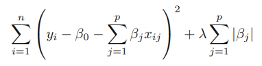
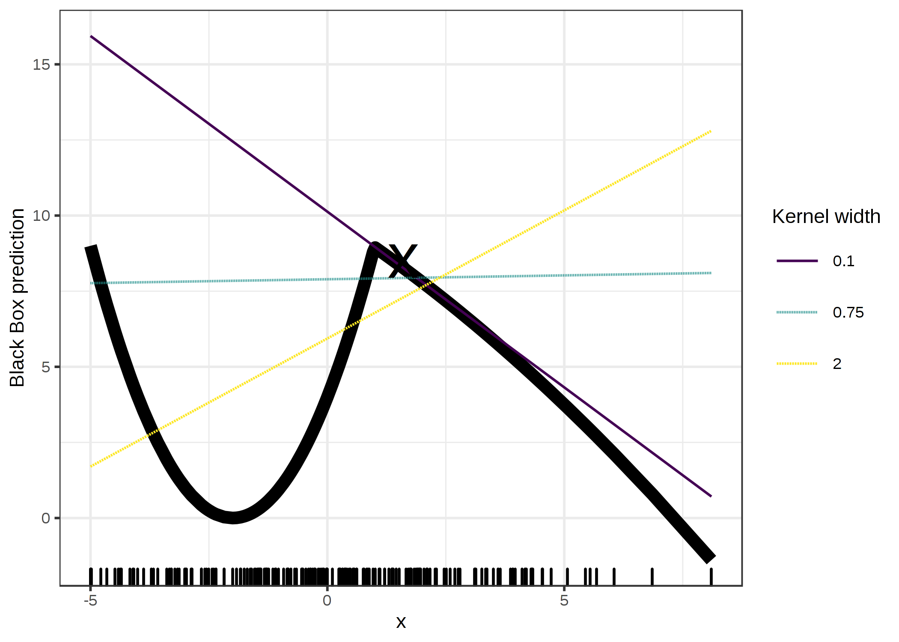

```{r eval=TRUE, include=FALSE}
knitr::opts_chunk$set(eval = FALSE)
knitr::opts_chunk$set(echo = FALSE)
knitr::opts_chunk$set(message = FALSE)
knitr::opts_chunk$set(warning = FALSE)
knitr::opts_chunk$set(fig.align = "center")
```

```{r}
save.image("data.RData")
```

```{r eval=TRUE}
load("data.RData")
```

```{r eval=TRUE}
library(moments)
library(factoextra)
library(keras)
library(glmnet)
library(reshape)
library(gplots)
library(ggplot2)
library(lime)
library(wordspace)
library(tidyr)
library(purrr)
library(mice)
library(MASS)
library(caret)
library(grid)
library(corrplot)
```


\newpage


TODO: template, mas subsecciones, numeracion, ...
TODO: hacerlo mas formal
TODO: referencias
TODO: figures: numerar, introducir y anadir texto, citar fuentes
TODO: salidas R formateadas, introducidas y numeradas
TODO: Anadir referencia a "On the Robustness of Interpretability Methods" (Alvarez-Melis and Jaakkola 2018). "Sometimes even slight changes in the neighborhood affects strongly obtained explanations."


# Introduction

\  


AI, machine learning, big data, . . . sometimes become buzzwords in an attempt by the press to depict the technology as something revolutionary or even mystical. Often companies use the same words for marketing
purposes, to present themselves as highly sophisticated when sometimes it’s not even clear if they are achieving anything really meaningful to improve their services through AI. Despite the need to keep the
expectations down to earth, machine learning is already providing tangible results in a wide range of problems, it’s becoming increasingly important and a norm in many industries. Private investment is accelerating
and governments around the world are also pouring money into what is considered a strategic sector. The momentum is there and it seems unlikely to stop.

One of the strong points of machine learning is its potential to add value in almost every known domain we know. Wherever there is data, machine learning can step in and help to take better decision, from improving the personal assistant in your mobile to helping in the prevention of diseases. This is why data is sometimes referred to as the "new electricity", the prospect of a future society that will greatly depend on consuming data through AI technology in every aspect of the everyday life. This feature of ubiquity of machine learning highlights the importance of understanding how decisions are taken, specially in applications involving sensitive areas such as health, privacy or social fairness, where trust needs to be built before the technology is fully adopted. In that spirit, the EU introduced recently what is commonly known as the "right to explanation" in the GDPR regulation:

_(71) The data subject should have the right not to be subject to a decision, which may include a measure, evaluating personal aspects relating to him or her which is based solely on automated processing and which produces legal effects concerning him or her or similarly significantly affects him or her, such as automatic refusal of an online credit application or e-recruiting practices without any human intervention. [1]_

Being able to explain the decisions taken by ML models is not just a matter of complying with regulation, it can also be an engineering tool to detect faults that otherwise would go unnoticed. For instance, lack of diversity in the data (or just not enough data) could make overfitting detection a hard task. The examination of the decisions could help to identify the problem in a qualitative way (e.g. is your image classifier focusing on the object related to the predicted label, or is the decision actually based on something in the background that happens to be correlated to the label in the data). Lack of generalization could also be exploited in adversarial attacks, a concern in fields like cybersecurity or automated driving. It is clear that the more interpretable the model is, the easier these problems can be avoided.

\  

## Scenario

When it comes to choosing and tuning a model to predict / explain data, we always face the predictability vs interpretability trade-off, naturally impossible to avoid. Sometimes a simpler model easy to explain is good enough, in other cases we don't want to forgo the prediction performance of a more opaque model. In this project we will aim to close the gap in the predictability vs interpretability trade-off as much as we can and will focus on the following scenario:

* Classification problems with tabular data. Tabular data is very common in many different domains.

* Data with a large number of regressors. Having to deal with high-dimensional data is specially challenging in terms of interpretability, the higher the number of independent variables, the higher the variance in the universe of explanations and therefore the more valuable would be a robust interpretation method.

* The aim of maximizing prediction accuracy. In general opaque models predict better for complex data than simple models, but it comes at a price, their outcomes are harder to explain.

\  

## Goals

To try to achieve this, we will resort to an interpretable model that is known for performing well with high-dimensional data, LASSO [2], and different ways to integrate it:

* As an interpretable model in charge of making predictions.

* As a surrogate model that tries to explain the mechanics of an opaque prediction model (a neural network).

* As a local surrogate model that tries to explain the predictions for particular observations done by an opaque prediction model (a neural network). LIME [3] will be the method to adapt LASSO to local regions of the data, dealing with nonlinearities and sparsity.

The goals of this project are the assessment of the different implementations of LASSO to explain classifications and how are they related to each other. In particular we want to compare the results from two different perspectives, a global perspective describing the classifications in a broad way and a local perspective that takes into account the peculiarities of given instances of interest, usually the case in practice. Understanding the classifications from both perspectives and their relationship is key to get a complete vision of the explanations and gain trust in the prediction model.

After presenting with more detail LASSO and LIME, we'll study two cases applying different interpretation methods and analyse the results. Dimensionality reduction will also be introduced as an alternative way to explain classifications in a more interpretable way. Namely, PCA components will be used in the interpretations replacing the original features.


\newpage


# Interpretable models

\

Interpretable models in the context of high-dimensional tabular data are models that manage to explain outcomes with a reduced number of meaningful features. LASSO and LIME fall in this category.

\  

## LASSO

LASSO (least absolute shrinkage and selection operator) is a well known linear model that adds regularization by introducing a coefficient penalization component. The amount of penalization is controlled by a parameter $\lambda$.  The quantity that is minimized is:

```{r eval = TRUE, out.width = '30%'}

```

It also performs feature selection. An intuitive way to understand how LASSO makes the selection of features is to see it as a linear optimization problem as illustrated in figure 2.1. The vertices of the constraint shape lie on axis intersections where some variables are set to zero due to the absolute value function in the penalization.

\  

\  

```{r eval = TRUE, out.width = '30%'}
knitr::include_graphics("pictures_1/the_lasso.png")
```
Fig. 2.1. LASSO approached as an optimization problem [4].

\  

LASSO improves accuracy in high-dimensional data by greatly decreasing variance at the expense of introducing some bias, while being very interpretable thanks to the reduced number of selected features.

Another application of LASSO are surrogate models. A surrogate model is an interpretable model that tries to mimic a non-interpretable model (which we will call black box from now on). The surrogate model is fit to the features of the training data and the outputs of the black box, its role is not to make predictions but to provide a way to understand how the black box makes predictions. The result is an approximation of the black box that helps to identify the features in the data that drive the predictions at a global level (i.e. for no particular prediction).

When the surrogate model is fit, overfitting is not something to avoid but rather welcomed since we want to get a good approximation of the black box (which already should have took care of properly generalizing the data). However there is a trade-off between how well the surrogate model fits the black box and the degree of interpretability of the surrogate model. This is known as the fidelity vs interpretability trade-off [3].

\  

\  

## LIME

\  

LIME (Local interpretable model-agnostic explanations) is a model-agnostic interpretable model that aims to close the fidelity vs interpretability gap at a local level. The method was proposed in the _Why Should I Trust You?: Explaining the Predictions of Any Classifier (Ribeiro, Singh, and Guestrin 2016)_ paper [3]. The intuition behind this technique is to approximate the black box locally by an interpretable model (like LASSO) by assuming that the data structure is linear around particular inputs, hence allowing for a model "tailored" to the region of interest.

\  

The goal is to find the local model that maximizes, in a balanced way, both the local fidelity and the interpretability. The idea is formalized as:

$\LARGE g_x = \displaystyle\arg \min_{g \in G} \mathcal{L}(f, g, \pi_{x}) + \Omega (g)$

Where, in our classification context:  
$x$ is the observation of interest for which we want to explain the classification.  
$g$ belongs to the universe $G$ of all possible interpretable models (LASSO, decision trees, ...).  
$g_x$ is the model explaining the classification of $x$ that is optimal in terms of both interpretability and fidelity.  
$\Omega (g)$ is a function that measures the complexity of an interpretable model (for instance the number of selected features by LASSO).  
$f$ represents the black box we are trying to explain. The response of the model are the probabilities than an observation belongs to certain classes.  
$\pi_{x}$ is a function that measures the distance between any observation in the data space an $x$.  
$\mathcal{L}(f, g, \pi_{x})$ is a function that measures how unfaithful $g$ is in approximating $f$ in the locality defined by $\pi_{x}$  

\  

In the example presented in figure 2.2 below, each axis represents an explanatory variable of the data, whereas the background color represents a binary classification. The observation of interest is the big red cross. If we zoom in enough, the frontier between different categories is linear and therefore the assumption of LIME is correct and we can fit a linear model with high fidelity. More data is simulated around the observation to compensate for the sparsity of data in the "zoommed in" region.

\  

```{r eval = TRUE, out.width = '50%'}
knitr::include_graphics("pictures_1/lime.png")
```
Fig. 2.2. LIME in a binary classification problem with 2-dimensional data [3].

\  

A big advantage with LIME is that the data representation for the interpretations can be decoupled from the original data fed to the black box. We could use whatever is more convenient for the interpretations while still using the original data to get the best possible predictions, as long as we keep a mapping between both data representations. This indirection property, in addition to the model-agnostic property, makes LIME very flexible.

A usual example of interpretable data representation are superpixels in the field of image classification. A superpixel represents a segment of an image that groups pixels that are interconnected and share similar colors. As opposed to individual pixels, this representation is natural for human understanding and simplifies the identification of specific regions that could have high influence in the classification of an image. For instance, the picture in figure 2.3 could be labelled as both dog and guitar. LIME, by fitting a surrogate model in a dataset that consists on copies of the original picture where only some superpixels are left enabled and their corresponding classifications done by the black box can identify which superpixels have an impact in the classification of the image for a particular label. The black box still uses the pixels to label the images, but the interpretation is done at a higher level, easier to understand for us than individual pixels.

```{r eval = TRUE, out.width = '100%'}
knitr::include_graphics("pictures_1/musician_dog.png")
```
Fig. 2.3. LIME explaining the predicted labels for dog playing guitar [3].


\newpage


# Case studies

\  

Two case studies are carried out. A first analysis is done on the data to set the expectations and gather the relevant information. Then the implementation of LIME and its parameters to tune is discussed, and finally the models are fit and the predictions and explanations are analysed and contrasted.

\  

## Data

The datasets used in the case studies come from fields where high-dimensional data is common: genomics and protein sequencing. Both datasets contain a large number of features, however in one of them the number of features largely exceeds the number of observations while the other has more observations than features. One contains very correlated features while the other shows little correlation. In short, two datasets of different nature.

\  

### Genes dataset

The data consists of 801 patients with tumors occurring in different parts of the body. The tumor types covered include: lung adenocarcinoma (LUAD), breast carcinoma (BRCA), kidney renal clear-cell carcinoma (KIRC), colon adenocarcinoma (COAD) and prostate adenocarcinoma (PRAD) [5]. The absolute frequencies are shown in figure 3.1.

```{r}
genes = read.csv(file = 'genes.csv')[,-1]
genes = genes[,colSums(genes != 0) > 0]
genes_pca = prcomp(scale(genes))

cancer_labels = read.csv(file = 'cancer.csv')[,2]

# 1 BRCA
# 2 COAD
# 3 KIRC
# 4 LUAD
# 5 PRAD
cancer = as.integer(cancer_labels)
```

```{r eval = TRUE, fig.width=3.5, fig.height=2.7}
genes_colours = rainbow(5, s=0.5)
barplot(table(cancer_labels), col=genes_colours, main="Absolute frequencies of the response", xlab="", cex.main=0.7, cex.axis=0.7, cex.sub=0.7, cex.names = 0.7)
```
Fig. 3.1. Number of observations for each category in the genes dataset.

Among more than 20,000 RNA sequencing gene expressions, the goal is to identify which gene expressions could have been altered through mutation causing the condition.

The distributions of the gene expressions are symmetric in general but not normal.


The distribution of means shown in figure 3.2 suggests there are two categories of gene expressions.

```{r eval = TRUE, fig.width=7, fig.height=2.7}
plot_stat_dists_genes <- function()
{
  stat_mean = c()
  for(i in 1:ncol(genes))
    stat_mean = c(stat_mean, mean(genes[,i]))
  
  plot(density(stat_mean), main = "Mean distribution", xlab = "mean", cex.main=0.7, cex.axis=0.7, cex.sub=0.7, cex.lab=0.7)
  
  stat_sd = c()
  for(i in 1:ncol(genes))
    stat_sd = c(stat_sd,sd(genes[,i]))
  
  plot(density(stat_sd), main = "Standard deviation distribution", xlab = "sd", cex.main=0.7, cex.axis=0.7, cex.sub=0.7, cex.lab=0.7, xlim=c(-0.5,6))
}

par(mfrow = c(1,2))
plot_stat_dists_genes()
par(mfrow = c(1,1))
```
Fig. 3.2. Kernel density estimations of mean and standard deviation of genes.

\  

The data is standardized to help with the training of the prediction model and the interpretations.

The explained variance concentration in a few PCA components shown in figure 3.3, plus having more than 20,000 gene expressions and only 5 categories suggests high multicollinearity.

```{r eval = TRUE, fig.width=3.5, fig.height=2.7}
plot(1:ncol(genes_pca$x), get_eigenvalue(genes_pca)$cumulative.variance.percent, xlab = "number of PCs", ylab = "cumulative variance %", type = "l", cex.main=0.7, cex.axis=0.7, cex.sub=0.7, cex.lab=0.7, main = "Genes PCA")
```
Fig. 3.3. Cumulative explained variance of genes PCA components.

\  

First 4 PCs look enough to classify the types of cancer despite only accounting for a third of the variability of the data as it can be observed in figure 3.4.  
LUAD is the category that overlaps the most with other categories.

```{r eval = TRUE, fig.width=8, fig.height=5}
pairs(genes_pca$x[,1:4], pch=19, col=genes_colours[cancer])
par(xpd = TRUE)
legend('bottomright', legend=c("BRCA","COAD","KIRC","LUAD","PRAD"), lty = 1, lwd = 2, cex=0.7, 
       col = c(rainbow(5, s=0.5)[1], rainbow(5, s=0.5)[2], rainbow(5, s=0.5)[3], rainbow(5, s=0.5)[4], rainbow(5, s=0.5)[5]))
```
Fig. 3.4. 2-dimensional data representations with the first 4 PCA components.

\  

\  

### Proteins dataset

The second dataset consists of 9972 proteins that are candidates for having anti-freezing properties. The goal is to identify which observations are antifreeze proteins (AFPs), important for the survival of animals, plants, fungi and bacteria in extreme cold environment conditions [6]. The data is imbalanced, only 1.8% of proteins are AFPs.

```{r}
proteins_train = read.csv(file = 'proteins_train.csv')
proteins_test = read.csv(file = 'proteins_test.csv')
proteins_pca = prcomp(scale(rbind(proteins_train[,2:ncol(proteins_train)],proteins_test[,2:ncol(proteins_test)])))
```

The 841 features represent attributes of the molecular structure of the proteins (amino acid and di-peptide compositions). The variances of the mean and standard deviation of the features are low as shown in figure 3.5.

```{r eval = TRUE, fig.width=7, fig.height=2.7}
plot_stat_dists_proteins <- function()
{
  prots = rbind(proteins_train[,2:ncol(proteins_train)],proteins_test[,2:ncol(proteins_test)])
  
  stat_mean = c()
  for(i in 1:ncol(prots))
    stat_mean = c(stat_mean, mean(prots[,i]))
  
  plot(density(stat_mean), main = "Mean distribution", xlab = "mean", cex.main=0.7, cex.axis=0.7, cex.sub=0.7, cex.lab=0.7, xlim = c(0,3.5))
  
  stat_sd = c()
  for(i in 1:ncol(prots))
    stat_sd = c(stat_sd,sd(prots[,i]))
  
  plot(density(stat_sd), main = "Standard deviation distribution", xlab = "sd", cex.main=0.7, cex.axis=0.7, cex.sub=0.7, cex.lab=0.7)
}

par(mfrow = c(1,2))
plot_stat_dists_proteins()
par(mfrow = c(1,1))
```
Fig. 3.5. Kernel density estimations of mean and standard deviation of protein features.

\  

The data is also standardized to help with the training of the prediction model and the interpretations. 
In contrast to the genes dataset, the variance is not concentrated in a small number of PCA components but rather the opposite as shown in figure 3.6:

```{r eval = TRUE, fig.height=2.7, fig.width=3.5}
plot(1:ncol(proteins_pca$x), get_eigenvalue(proteins_pca)$cumulative.variance.percent, xlab = "number of PCs", ylab = "cumulative variance %", type = "l", cex.main=0.7, cex.axis=0.7, cex.sub=0.7, cex.lab=0.7, main = "Proteins PCA")
```
Fig. 3.6. Cumulative explained variance of protein features PCA components.

\  

The correlation between features is very low. In the correlation plot in figure 3.7, 50 features picked at random are almost linearly independent. 

```{r eval = TRUE, fig.width=7, fig.height=7}
library(corrplot)

pr = rbind(proteins_train[,2:ncol(proteins_train)],proteins_test[,2:ncol(proteins_test)])
corrplot(cor(pr[,sample(1:840,50)]), type="upper", order="hclust", tl.cex = 0.5)
```
Fig. 3.7. Correlation plot of 50 features from the proteins dataset picked at random with hierarchical clustering order.


\newpage


## Implementation

\  

Different implementations of LIME exist. In this project we will use the _lime_ package in R, which implements the following steps:

* Before a local linear model is fit around an observation which classification we want to explain, new data points are simulated in the surroundings of the observation of interest. To achieve that, kernel density estimations are computed for each feature and sampled to simulate the new data, reducing the sparsity of the data and therefore the variance in the local fit for the explanation. The parameter to tune for this step is the number of simulated data points (*n_permutations*).

* Of data points simulated by sampling from the features kernel density estimations, we are specially interested in those in the surroundings to the observation of interest, as we are fitting a local model. So we need to give more weight to the data close to the instance of interest and this is done with a smoothing exponential kernel. The width of the kernel is a parameter of LIME (*kernel_width*) and probably the more difficult one to tune as shown in figure 3.8.   

\  

```{r eval = TRUE, out.width = '60%', fig.align="center"}

```
Fig. 3.8. LIME fitting in 1-dimensional data with different kernel widths [7].

> In this example changes in the kernel width lead to drastic changes in the local linear fit for the instance of interest (the cross in the plot). Adding more dimensions would increase the sensitivity of the width parameter even more [7].  

> The default value in the _lime_ package is $0.75 \sqrt{p}$, the more number of dimensions ($p$), the more the data sparse and therefore the kernel width should be increased accordingly. The appropriate value seems to depend on the surroundings of the data point being explained so there is not a clear rule of thumb to follow for all the cases.

> Another parameter is the distance function that measures the proximity between the instance of interest and the simulated data points (*dist_fun*). The default option is Gower’s distance but others like Euclidean or Manhattan can also be used.  

> TODO: Justificar la eleccion de la funcion de distancia para datasets sparse y con variables no normales.

* The next step is to feed the black box with the simulated data to get its response required to fit the local model.

* With the simulated data and the corresponding predictions, a local model is fit (*feature_select*). Several models are available, we will choose LASSO for two reasons: the high-dimensionality of our datasets and to get a better comparison with the global surrogate LASSO model.  
The local LASSO model will use the the output of the smoothing kernel to give more weight to the data points in the neighbourhood of the observation to explain.

* Finally the coefficients with higher absolute values are selected (*n_features*) to explain the output (*n_labels*, _1_ if we are just interested in the selected category).  


TODO: Tabla con los parametros escogidos:
model|n_permutations|n_features
genes||10

50000 permutations * 840 features matrix

The number of permutations in the simulated data is set to the maximum possible before start getting memory allocation errors (with 32GB RAM). The local model will be fit in a weighted 20000 permutations x 20257 genes matrix.

Different kernel widths have also been tried but without improvement.


\newpage


## Results

\  

### Interpretations with the original features

**Explaining tumor classifications with LASSO**

```{r}
training_index = sample(1:nrow(genes), nrow(genes)*0.8)

x_train_g = as.matrix(scale(genes[training_index,]))
x_test_g = as.matrix(scale(genes[-training_index,], center = colMeans(genes[training_index,]), scale = apply(genes[training_index,],2,sd)))

y_train_g = cancer[training_index]
y_test_g = cancer[-training_index]

# instability with the scaling on high dimension, 3 columns are dropped
x_train_g = x_train_g[,colSums(x_train_g != 0) > 0]
x_train_g = x_train_g[,colSums(is.na(x_train_g)) == 0]
x_test_g = x_test_g[,colnames(x_train_g)]
```


The aim is to reduce the number of genes to a bunch we can handle. It turns out that by fitting a LASSO prediction model with 80\% of the data and with optimal $\lambda$, the number of selected genes is indeed small, ranging between 5 and 13, depending on the category. LASSO managed to get rid of a vast amount of redundant information in form of multicollinearity by introducing some bias (the selection of genes).

The accuracy of the model with the remaining 20\% of the data is very close to 1, only two observations of category LUAD in the test data were misclassified:

```{r}
cvfit_g = cv.glmnet(x_train_g, y_train_g, alpha = 1, family = "multinomial")

y_test_pred_g = predict(cvfit_g, newx = x_test_g, s = cvfit_g$lambda.min, type="response")
y_test_pred_g = max.col(as.data.frame(y_test_pred_g))
```

```{r}
print(confusionMatrix(table(as.integer(y_test_pred_g), y_test_g)[1:5,1:5]))
```

LASSO classified with high accuracy and explained the data with a small manageable set of genes for each category, no opaque prediction model is required for this dataset. Something worth to mention too is how computationally efficient is LASSO, crucial when dealing with high-dimensional data.

\  

**Explaining tumor classifications with LIME**

LIME purpose is usually to explain non-interpretable models, nevertheless because the goal in this project is to explore the relationships between global explanations and local explanations, we now explain with LIME the classification done by the LASSO prediction model for each of the 640 observations in the training data. We keep the number of selected features low (10 features, in the same range as with the LASSO prediction model) for the sake of interpretability.

```{r}
model_type.cv.glmnet <- function(x, ...) {"classification"}
predict_model.cv.glmnet <- function (x, newdata, type, ...) {
  pred = predict(x, newx = as.matrix(newdata), s = x$lambda.min, type="response")
  data.frame(BRCA = pred[,1,], COAD = pred[,2,], KIRC = pred[,3,], LUAD = pred[,4,], PRAD = pred[,5,])
}

model_type.keras.engine.sequential.Sequential <- function(x, ...) {"classification"}
predict_model.keras.engine.sequential.Sequential <- function (x, newdata, type, ...) {
  pred <- predict(object = x, x = as.matrix(newdata))
  data.frame(AFP = pred[,1])
}
```

```{r message=FALSE, warning=FALSE}
explainer_g = lime(

  x = as.data.frame(x_train_g),
  model = cvfit_g,
  use_density = TRUE,
  bin_continuous = FALSE
)

get_instance_explanation_g <- function(datapoints_index) {

  lime::explain(
    x = as.data.frame(x_train_g)[datapoints_index,],
    explainer = explainer_g, 
    n_permutations = 500,
    feature_select = "lasso_path",
    n_features = 10,
    n_labels = 1
  )
}

get_lime_coeffs_g <- function(category)
{
  datapoints_index = which(y_train_g == category)
  
  explan = get_instance_explanation_g(datapoints_index[1])
  explan$case = 1
  
  for (i in 2:length(datapoints_index))
  {
    print(i)
    temp = get_instance_explanation_g(datapoints_index[i])
    temp$case = i
    explan = rbind(explan, temp)
  }

  explan_cases = tidyr::nest(explan, key = -case)
  
  feats = unique(explan$feature)
  
  coeffs_cat = setNames(data.frame(matrix(ncol = length(feats)+1, nrow = 0)), c(feats,"model_r2"))
  coeffs_names = vector()
  
  for (i in 1:nrow(explan_cases)) {
    
    c = explan_cases[[2]][[i]]
    
    for (j in 1:length(c$feature))
      coeffs_cat[i,c$feature[j]] = c$feature_weight[j]
    
    coeffs_cat[i,"model_r2"] = c$model_r2[1]
    coeffs_names = c(coeffs_names, paste(levels(cancer_labels)[category],explan_cases$case[i]))
  }
  
  rownames(coeffs_cat) = coeffs_names
  coeffs_cat[is.na(coeffs_cat)] = 0
  
  coeffs_cat
}
```

```{r}
lime_BRCA = get_lime_coeffs_g(1)
lime_COAD = get_lime_coeffs_g(2)
lime_KIRC = get_lime_coeffs_g(3)
lime_LUAD = get_lime_coeffs_g(4)
lime_PRAD = get_lime_coeffs_g(5)

lime_model_r2_g = list(lime_BRCA[,ncol(lime_BRCA)], lime_COAD[,ncol(lime_COAD)], lime_KIRC[,ncol(lime_KIRC)], lime_LUAD[,ncol(lime_LUAD)], lime_PRAD[,ncol(lime_PRAD)])

lime_BRCA = lime_BRCA[,1:(ncol(lime_BRCA)-1)]
lime_COAD = lime_COAD[,1:(ncol(lime_COAD)-1)]
lime_KIRC = lime_KIRC[,1:(ncol(lime_KIRC)-1)]
lime_LUAD = lime_LUAD[,1:(ncol(lime_LUAD)-1)]
lime_PRAD = lime_PRAD[,1:(ncol(lime_PRAD)-1)]

gc()
```

\

Note that LIME is not explaining just the classifications done by the LASSO prediction model, but its outputs (probabilities). On average, the response variance explained by LIME is high, but LIME does not fit to the inputs and outputs of LASSO evenly for all the categories. In figure 3.9. we can find more unexplained response for category KIRC.

```{r, fig.height=3, fig.width=4}
plot(density(lime_model_r2_g[[1]]), xlim=c(0.55,0.9), ylim=c(0,30), col=genes_colours[1], xlab = expression(R^2), main = "Distribution of explained response variance", cex.main=0.7, cex.axis=0.7, cex.sub=0.7, cex.lab=0.7)

lines(density(lime_model_r2_g[[2]]), col=genes_colours[2])
lines(density(lime_model_r2_g[[3]]), col=genes_colours[3])
lines(density(lime_model_r2_g[[4]]), col=genes_colours[4])
lines(density(lime_model_r2_g[[5]]), col=genes_colours[5])

legend('topleft', legend=c("BRCA","COAD","KIRC","LUAD","PRAD"), lty = 1, lwd = 2, cex=0.5, 
       col = c(rainbow(5, s=0.5)[1], rainbow(5, s=0.5)[2], rainbow(5, s=0.5)[3], rainbow(5, s=0.5)[4], rainbow(5, s=0.5)[5]))
```
Fig. 3.9. Kernel distribution estimations of the response variance explained by LIME in tumor classifications done by LASSO.

\  

To compare the genes selected globally by the LASSO prediction model with those selected locally by LIME, since LIME interpretations for different observations in a specific category will potentially include different selected genes, we have to make a single selection of genes summarizing all the LIME interpretations for each category.

To identify the most influential genes selected by LIME, the sums of the absolute values of the coefficients of all the selected genes are computed. Figure 3.10 displays a heatmap of the 30 most influential genes according to LIME.

```{r eval = TRUE, fig.height=8, fig.width=6}
abs_sums_BRCA = apply(abs(lime_BRCA), 2, sum)
abs_sums_COAD = apply(abs(lime_COAD), 2, sum)
abs_sums_KIRC = apply(abs(lime_KIRC), 2, sum)
abs_sums_LUAD = apply(abs(lime_LUAD), 2, sum)
abs_sums_PRAD = apply(abs(lime_PRAD), 2, sum)

plot_coeff_abssum <- function()
{
  feats = Reduce(union, c(names(abs_sums_BRCA), names(abs_sums_COAD), names(abs_sums_KIRC), names(abs_sums_PRAD), names(abs_sums_LUAD)))
  m = setNames(data.frame(matrix(ncol = length(feats), nrow = 0)), feats)
  
  m[1,names(abs_sums_BRCA)] = abs_sums_BRCA
  m[2,names(abs_sums_COAD)] = abs_sums_COAD
  m[3,names(abs_sums_KIRC)] = abs_sums_KIRC
  m[4,names(abs_sums_LUAD)] = abs_sums_LUAD
  m[5,names(abs_sums_PRAD)] = abs_sums_PRAD

  rownames(m) = c("BRCA","COAD","KIRC","LUAD","PRAD")
  
  m = t(m)
  m[is.na(m)] = 0
  m = normalize.cols(m)

  order = names(sort(rowSums(m),decreasing = TRUE))
  
  par(cex.main=0.7)
  heatmap.2(m[order[1:30],], dendrogram="none", col= colorRampPalette(c("white","blue"))(n = 99), breaks=seq(0,1,length=100), symkey=FALSE, key=TRUE, Rowv=F, Colv=F, cexCol =1, cexRow = 0.8, srtCol=45, main="30 more influential genes\n in tumor classification (normalized)")
}

plot_coeff_abssum()
```
Fig. 3.10. Heatmap of the sum of the coefficient absolute values of the genes selected by LIME for all the observations in the training data (normalized).


\  

```{r}
#An observation belonging to LUAD category is picked up at random to explain its classification. Observations in LUAD category overlap the most with other categories, they are the hardest to predict and hence more interesting to explain.

#Below in figure x.x are displayed the distributions of the coefficients of the first 16 more influential components for category LUAD. The vertical red line represents the mean, the blue one represents the median.  

#We can see that the distributions of the more influential components are more or less symmetric, whereas the less influential ones are bimodal, one of the modes lying on value 0 which represents the absence of influence for a subset of observations and the other. These are negligible ...

#To avoid the components that only appear as influential for a few observations (and when they are included in the list of 10 more important components their value is very small) we use the median to compute the coefficients of the components for the whole category. The median will ignore components that come up rarely and have small values by setting them to 0 in the summarize component coefficient.  
```


```{r}
# eval = TRUE, fig.height=6, fig.width=10
print_distributions <- function(co, infl, le)
{
  means = apply(co, 2, mean)
  medians = apply(co, 2, median)
  key = names(infl)[1:16]

  co[,key] %>%
  keep(is.numeric) %>% 
  gather(key) %>% 
  ggplot(aes(value)) +
  facet_wrap(~ factor(key, levels=names(infl)[1:16]), scales = "free") + 
  geom_density() + 
  geom_rug(colour="red") +
  geom_vline(xintercept=means[key], size=0.5, color="red") + 
  geom_vline(xintercept=medians[key], size=0.5, color="blue") + 
  ggtitle(sprintf("Coefficients of the 16 more influential components for %s classification",le)) + 
  theme(plot.title = element_text(hjust = 0.5))
}

print_distributions(lime_LUAD,infl_comp_LUAD,"LUAD")
```


\newpage

When the sum of the coefficient absolute values of a gene is very close to 0, the gene came up in the explanations rarely and with negligible coefficients. Those are left out and the remaining ones are summarized with the median (the mean yields similar values).

In figure 3.11, the plot at the left displays the genes selected by the LASSO prediction model, the plot at the right displays the genes selected by LIME on aggregate to explain the classifications done by the LASSO prediction model.

```{r}
generate_histo <- function(coeffs, y_lab, ordered = FALSE, remove_blank_rows = TRUE)
{
  coeff_matrix = t(coeffs)
  
  if (remove_blank_rows)
    coeff_matrix = coeff_matrix[rowSums(coeff_matrix) != 0,] #removing rows with all surrogate_coeffs set to 0
  
  for(i in 1:nrow(coeff_matrix)){
    for(j in 1:ncol(coeff_matrix)){
      coeff_matrix[i,j] <- ifelse(coeff_matrix[i,j] < 0, -1,
                                  ifelse(coeff_matrix[i,j] > 0, 1, 0))
    }
  }
  
  # Melt de hat_betas_fd + factores
  to_plot <- coeff_matrix
  colnames(to_plot)  <- colnames(coeff_matrix)
  aux <- c()
  
  for(j in 1:ncol(coeff_matrix)){ # "Truco ordenación"
    aux <- c(aux, which(to_plot[,j]!=0))
  }
  
  if (ordered)
  {
    aux = rownames(coeff_matrix)
  }else
  {
    aux = rownames(to_plot)[aux]
  }
    
  aux <- unique(aux)
  # aux are the features with non-0 values
  
  to_plot2 <- melt(to_plot)
  colnames(to_plot2) <- c(y_lab,"category","value")

  if(!ordered)
  {
    to_plot2[[y_lab]] <- factor(to_plot2[[y_lab]], levels = aux)
    to_plot2$category <- factor(to_plot2$category)
    to_plot2$value <- factor(to_plot2$value, levels = c(-1, 0, 1))  
  
    #to_plot2[[y_lab]] = as.character(to_plot2[[y_lab]])
    #to_plot2 = to_plot2[order(to_plot2[[y_lab]]),]
    #to_plot2[[y_lab]] = as.factor(to_plot2[[y_lab]])
  }else
  {
    to_plot2[[y_lab]] <- factor(to_plot2[[y_lab]], levels = aux)
    to_plot2$category <- factor(to_plot2$category)
    to_plot2$value <- factor(to_plot2$value, levels = c(-1, 0, 1)) 
  }
  
  to_plot2
}

multiplot <- function(..., plotlist=NULL, file, cols=1, layout=NULL) {
  require(grid)

  # Make a list from the ... arguments and plotlist
  plots <- c(list(...), plotlist)

  numPlots = length(plots)

  # If layout is NULL, then use 'cols' to determine layout
  if (is.null(layout)) {
    # Make the panel
    # ncol: Number of columns of plots
    # nrow: Number of rows needed, calculated from # of cols
    layout <- matrix(seq(1, cols * ceiling(numPlots/cols)),
                    ncol = cols, nrow = ceiling(numPlots/cols))
  }

 if (numPlots==1) {
    print(plots[[1]])

  } else {
    # Set up the page
    grid.newpage()
    pushViewport(viewport(layout = grid.layout(nrow(layout), ncol(layout))))

    # Make each plot, in the correct location
    for (i in 1:numPlots) {
      # Get the i,j matrix positions of the regions that contain this subplot
      matchidx <- as.data.frame(which(layout == i, arr.ind = TRUE))

      print(plots[[i]], vp = viewport(layout.pos.row = matchidx$row,
                                      layout.pos.col = matchidx$col))
    }
  }
}

get_lasso_explainer <- function(surrogate, wanted_n_features = 50){
  
  surrogate_coeffs = coef(surrogate)
  
  coeffs = vector(mode = "list", length = 5)
  names(coeffs) = c("1","2","3","4","5")
  index = coeffs
  lambda = coeffs
  r2 = coeffs
  
  for (i in 1:5) {
  
    # Code I picked up from the LIME package: https://github.com/thomasp85/lime/blob/49df0a131deee4919a29bb6093c116b80b766d3d/R/lime.R#L22
    lasso_sparse = surrogate_coeffs[[as.character(i)]]
    has_value = apply(as.matrix(lasso_sparse[-1,]), 2, function(x) x != 0) 
    f_count = apply(has_value, 2, sum)  # number of parameters for each lambda (columns in lasso_sparse)
    
    # In case that no model with correct n_feature size was found return features <= wanted_n_features
    lambda_index <- rev(which(f_count <= wanted_n_features))[1]
    
    # Selected features
    index[[as.character(i)]] = which(has_value[, lambda_index])
    coeffs[[as.character(i)]] = lasso_sparse[which(has_value[, lambda_index])+1,lambda_index]
    lambda[[as.character(i)]] = surrogate[["lambda"]][lambda_index]
    r2[[as.character(i)]] = surrogate[["dev.ratio"]][lambda_index]
  }
    
  list(index = index, coeffs = coeffs, lambda = lambda, r2 = r2)
}
```

```{r eval = TRUE, fig.height=8, fig.width=8}

get_lasso_coeffs <- function(){
  
  lasso_exp = get_lasso_explainer(cvfit_g) # only 1 model with the optimal lambda is passed
  lasso_feat = names(lasso_exp[["coeffs"]][[as.character(1)]])
  
  for (i in 2:5){
  
    gene_names = names(lasso_exp[["coeffs"]][[as.character(i)]])
    lasso_feat = Reduce(union,c(lasso_feat,gene_names))
  }
  
 coeffs_lasso_g = setNames(data.frame(matrix(ncol = length(lasso_feat), nrow = 0)), lasso_feat)
  
  for (i in 1:5){
  
    cof = lasso_exp[["coeffs"]][[as.character(i)]]
  
    for (j in 1:(length(cof)))
      coeffs_lasso_g[i,names(cof)[j]] = cof[j]
  }
  
  rownames(coeffs_lasso_g) = levels(cancer_labels)
  coeffs_lasso_g[is.na(coeffs_lasso_g)] = 0

  coeffs_lasso_g
}

coeffs_lasso_g = get_lasso_coeffs()

get_coeffs_lime_g <- function(){
  
  coeffs_lime_g = setNames(data.frame(matrix(ncol = ncol(coeffs_lasso_g), nrow = 5)), colnames(coeffs_lasso_g))
  coeffs_lime_g[,] = 0
  
  m = t(fun_coeffs_g)
  coeffs_lime_g[1:5,colnames(m)] = m[1:5,colnames(m)]
  coeffs_lime_g = coeffs_lime_g[,unique(colnames(coeffs_lasso_g))]
  rownames(coeffs_lime_g) = c("BRCA","COAD","KIRC","LUAD","PRAD")
  
  coeffs_lime_g
}

coeffs_lime_g = get_coeffs_lime_g()

histo_lasso_plot = ggplot(generate_histo(coeffs_lasso_g, "gene", FALSE), aes(x = category, y = gene, fill = value)) + 
  geom_tile() +
  ggtitle("Most influential genes in the prediction LASSO model") + 
  scale_fill_manual(values = c("brown1", "white", "dodgerblue")) +
  theme(axis.text.y = element_text(color="black", size=8),
        legend.position = "none",
        plot.title = element_text(size=9, colour = "gray33", hjust = 0.5),
        axis.ticks.y.left = element_blank())

histo_lime_plot = ggplot(generate_histo(coeffs_lime_g, "gene", TRUE, FALSE), aes(x = category, y = gene, fill = value)) + 
  geom_tile() +
  ggtitle("Most influential genes in LIME (medians)") + 
  scale_fill_manual(values = c("brown1", "white", "dodgerblue")) +
  theme(axis.text.y = element_text(color="black", size=8),
        plot.title = element_text(size=9, colour = "gray33", hjust = 0.5),
        axis.ticks.y.left = element_blank(),
        axis.text.y.left = element_blank())

multiplot(histo_lasso_plot, histo_lime_plot, cols=2)
```
Fig 3.11. Comparison between LASSO and LIME explanations (medians) in tumor classification.

Both selections show correlation, although there are some noticeable differences. The genes selected by LASSO for each category are mutually exclusive sets, whereas in LIME explanations, some genes are important in most of the categories.


\newpage


**Explaining antifreeze protein classification with LASSO**

To tackle the imbalanced data, the training data is down-sampled, ending up with 600 observations, half of them antifreeze proteins.

A LASSO model is fit to identify antifreeze proteins. It achieves 0.84 of balanced accuracy with a selection of 51 features through cross-validation.

```{r}
x_train_p = as.matrix(scale(proteins_train[,2:ncol(proteins_train)]))
y_train_p = ifelse(proteins_train[,1] == "AFP",1,0)

x_test_p = as.matrix(scale(proteins_test[,2:ncol(proteins_test)], center = colMeans(proteins_train[,2:ncol(proteins_train)]), scale = apply(proteins_train[,2:ncol(proteins_train)],2,sd)))
y_test_p = ifelse(proteins_test[,1] == "AFP",1,0)
```

```{r}
set.seed(3)
shuffle = sample(nrow(x_train_p))
cvfit_p = cv.glmnet(x_train_p[shuffle,], y_train_p[shuffle], alpha = 1, family = "binomial")
coeffs_lasso_p = coef(cvfit_p)
length(coeffs_lasso_p@x)
```

```{r eval = TRUE}
y_test_pred_p_lasso = as.factor(as.integer(predict(cvfit_p, newx = x_test_p, s = cvfit_p$lambda.min, type="response") > 0.5))
print(confusionMatrix(table(y_test_pred_p_lasso, y_test_p)[2:1,2:1]))
```


\  

Alternatively another candidate model is fit for the classifications, this time a fully connected neural network with one hidden layer, a non-interpretable model with tens of thousands of parameters. 

This model brings a small accuracy improvement of 0.02 with respect to LASSO model. Even if the improvement is modest it could be relevant in terms of research cost savings. Moreover, further improvements in the parameter tuning of the neural network are still possible while maintaining the interpretability.

TODO: The interpretable model in the scope of this project will be model-agnostic, a model that only uses the input and the output of the prediction model, not caring about the prediction model itself. This independence could come in handy if at some point the prediction model has to be replaced with some other model performing better, something not unusual in the constantly changing field that is ML. The model-agnostic interpretable model will always remain valid at no development cost.

TODO: analizar si es mejor evitar mas los falsos positivos

```{r eval = TRUE, include=FALSE}
keras_seed = 3

black_box = keras_model_sequential() %>% 
  layer_dense(units = 64, activation = "relu", input_shape = ncol(x_train_p), kernel_initializer=initializer_random_uniform(minval = -0.05, maxval = 0.05, seed = keras_seed)) %>% 
  layer_dropout(0.7) %>%
  layer_dense(units = 10, activation = "relu", kernel_initializer=initializer_random_uniform(minval = -0.05, maxval = 0.05, seed = keras_seed)) %>%
  layer_dropout(0.2) %>%
  layer_dense(units = 1, activation = "sigmoid", kernel_initializer=initializer_random_uniform(minval = -0.05, maxval = 0.05, seed = keras_seed))

black_box %>% compile(
  optimizer = optimizer_adam(lr = 0.005),
  loss = "binary_crossentropy",
  metrics = c("accuracy","FalseNegatives","FalsePositives")
)

set.seed(3)
black_box_history = black_box %>% fit(
  x_train_p,
  y_train_p,
  epochs = 24,
  batch_size = 600,
  validation_data = list(x_test_p, y_test_p)
)
```

```{r eval = TRUE}
y_test_pred_p = as.integer((black_box %>% predict(x_test_p)) > 0.5)
print(confusionMatrix(table(as.integer(y_test_pred_p), y_test_p)[2:1,2:1]))
```

\  

To explain the predictions of the neural network, a global surrogate LASSO model is fit with the features of the training data and the corresponding outputs of the neural network. This approach involves the possibility of adjusting the number of selected features explaining the classifications without compromising the accuracy in the predictions that are still performed by the neural network. The fidelity vs interpretability trade-off shown in figure 3.12 has to be considered in the choice.

We will target at least 80% of fidelity to explain the classifications done by the neural network, which requires 173 selected features.

```{r}
get_lasso_explainer_p <- function(surrogate, wanted_n_features = 50){
  
  surrogate_coeffs = coef(surrogate)
  
  lasso_sparse = surrogate_coeffs
  has_value = apply(as.matrix(lasso_sparse[-1,]), 2, function(x) x != 0) 
  f_count = apply(has_value, 2, sum)  # number of parameters for each lambda (columns in lasso_sparse)
  lambda_index <- rev(which(f_count <= wanted_n_features))[1]
  
  # Selected features
  index = which(has_value[, lambda_index])
  coeffs = lasso_sparse[which(has_value[, lambda_index])+1,lambda_index]
  lambda = surrogate[["lambda"]][lambda_index]
  r2 = surrogate[["dev.ratio"]][lambda_index]
  
  list(index = index, coeffs = coeffs, lambda = lambda, r2 = r2)
}

y_train_pred_p = as.integer((black_box %>% predict(x_train_p)) > 0.5)
surrogate_lasso_p = glmnet(x_train_p, y_train_pred_p, alpha = 1, family = "binomial", nlambda = 600, lambda.min.ratio = 0.00001)

interpretability_p = 1:ncol(x_train_p)
fidelity_p = c()

for (n_features in interpretability_p) {
  surrogate_lasso_explainer_p = get_lasso_explainer_p(surrogate_lasso_p, n_features)
  fidelity_p = c(fidelity_p,surrogate_lasso_explainer_p[["r2"]])
}
```

```{r eval = TRUE, fig.height=3, fig.width=5}
n_features_p = 173

plot(interpretability_p, fidelity_p, xlab = "number of variables in the lasso surrogate model", ylab = expression(R^2), type = "l", main = "Explaining antifreeze proteins", cex.main=0.7, cex.axis=0.7, cex.sub=0.7, cex.lab=0.7)
abline(h=0.8, lty=2)
abline(v=n_features_p, lty=2)
```
Fig 3.12. Trade-off between how well the surrogate model explains the black box predictions and the number of selected features in the explanations.

\  

\  

**Explaining antifreeze protein classification with LIME**

Global surrogate models provide a global sense of the influence of the features in the response. However if the data structure is complex, it might not explain well some predictions if the global surrogate model does not fit the black box well enough. Some particular regions of the data space could be dominated by specific features that got overlooked by the global surrogate model, in other words, the fidelity of the global surrogate model is not constant across the data space.

The classifications of the 600 proteins in the training data done by the neural network are now explained with LIME, with the same number of selected features as with the surrogate LASSO model.

```{r message=FALSE, warning=FALSE}
explainer_all_p <- lime(
  x = as.data.frame(x_train_p),
  model = black_box,
  use_density = TRUE,
  bin_continuous = FALSE
)

get_instance_explanation_p <- function(datapoints_index) {
  
  lime::explain(
    x = as.data.frame(x_train_p)[datapoints_index,],
    explainer = explainer_all_p, 
    n_permutations = 5000,
    feature_select = "lasso_path",
    n_features = n_features_p,
    n_labels = 1
  )
}

get_explanations_p <- function()
{
  expla = get_instance_explanation_p(1)
  expla$case = 1
  
  for (i in 2:nrow(x_train_p))
  {
    print(i)
    
    temp = get_instance_explanation_p(i)
    temp$case = i
    expla = rbind(expla, temp)
  }

  expla_cases = tidyr::nest(expla, key = -case)
  
  feats = unique(expla$feature)
  
  coeffs = setNames(data.frame(matrix(ncol = length(feats)+1, nrow = 0)), c(feats,"model_r2"))
  coeffs_names = vector()
  
  for (i in 1:nrow(expla_cases)) {
    
    c = expla_cases[[2]][[i]]
    
    for (j in 1:length(c$feature))
      coeffs[i,c$feature[j]] = c$feature_weight[j]
    
    coeffs[i,"model_r2"] = c$model_r2[1]
    coeffs_names = c(coeffs_names, paste("case",expla_cases$case[i]))
  }
  
  rownames(coeffs) = coeffs_names
  coeffs[is.na(coeffs)] = 0
  
  coeffs
}
```

```{r}
lime_protes = get_explanations_p()
model_r2_protes = lime_protes[,ncol(lime_protes)]
lime_protes = lime_protes[,1:(ncol(lime_protes)-1)]
```

TODO: ejemplo de uno en el limite (robustez)
```{r}
lime_test = get_instance_explanation_p(1)
lime_test2 = get_instance_explanation_p(1)
lime_test2$case = 2
length(unique(union(lime_test$feature,lime_test2$feature)))
plot_features(lime_test)
plot_explanations(rbind(lime_test,lime_test2))
```


\  

The response variance percentage of the output of the neural network explained by LIME is around 0.52 as shown in figure 3.13.

```{r, fig.height=3, fig.width=4}
plot(density(model_r2_protes), xlab = expression(R^2), main = "Distribution of explained response variance", cex.main=0.7, cex.axis=0.7, cex.sub=0.7, cex.lab=0.7)
```
Fig 3.13. Kernel distribution estimations of the response variance explained by LIME in protein classification

Kernel distribution estimations of the response variance explained by LIME


\newpage

In figure 3.14 below, the influence of the features selected by the three interpretability methods implemented (straight LASSO, global surrogate LASSO and LIME) are compared.

```{r eval = TRUE, fig.height=12, fig.width=8}
get_coeffs_protes <- function()
{
  influence_lime_p = apply(lime_protes, 2, mean)
  influence_lime_p = influence_lime_p[names(sort(abs(influence_lime_p), decreasing = TRUE))[1:n_features_p]]
  #influence_lime_p = influence_lime_p / sqrt(sum(influence_lime_p^2)) # normalizing
  
  surrogate_lasso_explainer_p = get_lasso_explainer_p(surrogate_lasso_p, n_features_p)
  influence_surro_p = sort(surrogate_lasso_explainer_p[["coeffs"]])
  
  lasso_explainer_p = get_lasso_explainer_p(cvfit_p, n_features_p)
  influence_lasso_p = sort(lasso_explainer_p[["coeffs"]])
  
  feats = unique(Reduce(union, c(names(influence_surro_p),names(influence_lasso_p),names(influence_lime_p))))

  coeffs_merge = setNames(data.frame(matrix(ncol = length(feats), nrow = 0)), feats)
  coeffs_merge[1,names(influence_surro_p)] = influence_surro_p
  coeffs_merge[2,names(influence_lasso_p)] = influence_lasso_p
  coeffs_merge[3,names(influence_lime_p)] = influence_lime_p
  coeffs_merge[is.na(coeffs_merge)] = 0
  
  m = t(coeffs_merge)
  colnames(m) = c("surrogate","lasso","lime")
  m = as.data.frame(m)
  m = m[order(m$surrogate),]
  m = normalize.cols(as.matrix(m))
  m = as.data.frame(m)
}

coeffs_protes = get_coeffs_protes()

blue <- rgb(75/256,0,130/256, alpha=0.5)
yellow <- rgb(255/256, 192/256, 0, alpha=0.5)
green <- rgb(191/256,255/256,0, alpha=0.5)

par(mfrow=c(1,3))
barplot(coeffs_protes[,1], horiz = T, las=1, cex.names = 0.8, main = "Most influential features\n with neural network (surrogate LASSO)", cex.main = 1, xlim = c(-0.6,0.4), col=blue, space = 0.5, xpd = TRUE, beside = TRUE)
#par(new = T)
barplot(coeffs_protes[,2], horiz = T, las=1, main = "Most influential features\n with LASSO", cex.names = 0.5, cex.main = 1, xlim = c(-0.6,0.4), col=yellow, space = 0.5, xpd = TRUE, beside = TRUE, axis.lty=30)
#par(new = T)
barplot(coeffs_protes[,3], horiz = T, las=1, main = "Most influential features\n with neural network (LIME medians)", cex.names = 0.5, cex.main = 1, xlim = c(-0.6,0.4), col=green, space = 0.5, xpd = TRUE, beside = TRUE)
par(mfrow=c(1,1))
```
Fig 3.14. Levels of influence of the most influential features selected by the three interpretation methods side by side. There are more than 200 features, ordered by level of influence in the surrogate LASSO model.

\  

There is a clear correlation between the features selected by the LASSO prediction model and the features selected by global surrogate LASSO model explaining the neural network, the main difference being some features that are ignored by the neural network but are among the most 10 important features in the LASSO model prediction and vice versa. This is something expected, the neural network is fits nonlinearities and predicts differently from LASSO.

There is also correlation between the features selected in the LIME explanations and the features selected in the other two models, however there are no dominant features and about one third of the features that came up in the LIME explanations are not considered important in the LASSO global models, because the relations of the features with the response is not homogeneous across all the observations.

```{r eval = TRUE, fig.height=7, fig.width=7}
corrplot(cor(coeffs_protes),  cl.cex=1, tl.cex=0.8)
```


\newpage


### Interpretation with alternative interpretable data representations

\  

173 features in the explanations of protein classifications is still a an overwhelming number of features to handle. Next, we will try to find alternative data representations to better explain the classification of proteins done by the neural network. The idea is similar to the use of superpixels to explain labels in image classification explained in 2.2, but for high dimensional tabular data.

\  

**Interpretation with PCA components**

A first method to get a more interpretable data representation with tabular data would be dimensionality reduction. We will use classic PCA which could help in two ways:

* To reduce the number of features to deal with while maintaining or increasing fidelity.
* To potentially get hidden meaningful features from linear combinations of the original features.

The usefulness of this method will depend on the practitioner, expert in the domain, being able to make sense of the main components involved in the explanations.

```{r}
get_eigenvalue(proteins_pca)$cumulative.variance.percent[150]
```


The global surrogate LASSO model is fit again with the first 150 PCA components (accounting for 41% of the variance in the data). For the same level of fidelity we targeted with the original features (0.8), the number of components required in the explanations is reduced to 115 (from 173 with the original features). We should take into account how uncorrelated are the features in the proteins dataset in particular. With other datasets the reduction in the number of required components could be much higher.

```{r}
x_train_pca_p = prcomp(x_train_p)

colnames(x_train_pca_p$x) = sprintf("PC%03d", 1:ncol(x_train_pca_p$x))
colnames(x_train_pca_p$rotation) = sprintf("PC%03d", 1:ncol(x_train_pca_p$rotation))
```

```{r eval = TRUE, fig.height=3, fig.width=5}
pcs_n_p = 150

surrogate_lasso_pca_p = glmnet(x_train_pca_p$x[,1:pcs_n_p], y_train_pred_p, alpha = 1, family = "binomial", nlambda=200, lambda.min.ratio=0.0000001)

interpretability_pca_p = 1:pcs_n_p
fidelity_p = c()

for (n_features in interpretability_pca_p) {
  surrogate_lasso_explainer_p = get_lasso_explainer_p(surrogate_lasso_pca_p,n_features)
  fidelity_p = c(fidelity_p,surrogate_lasso_explainer_p[["r2"]])
}

n_features_pca_p = 115

plot(interpretability_pca_p, fidelity_p, xlab = "number of selected PCA components in the surrogate model", ylab = expression(R^2), type = "l", cex.main=0.7, cex.axis=0.7, cex.sub=0.7, cex.lab=0.7,
     main = "Explaining antifreeze proteins with PCA")
abline(v=n_features_pca_p, lty=2)
abline(h=0.8, lty=2)
```
Fig 3.15. Trade-off between how well the surrogate model explains the black box predictions and the number of selected PCA components in the explanations

\  

The LIME interpretations are repeated for all the observations in the training data, this time using the first 150 PCA components as interpretable data representation and selecting 115 components to explain each observation.

```{r}
preprocessing_p <- function(x){

  # reversing PCA (with the remaining info) to feed the black box which only understands the original data - individual genes
  a = as.matrix(x) %*% t(x_train_pca_p$rotation[,1:pcs_n_p])
  b = t(a) + x_train_pca_p$center
  t(b)
}

explainer_PCA_p = lime(
  x = as.data.frame(x_train_pca_p$x)[,1:pcs_n_p],
  model = black_box,
  use_density = TRUE,
  bin_continuous = FALSE,
  preprocess = preprocessing_p
)

get_PCA_explanation_p <- function(datapoints_index)
{
  lime::explain(
    # converting train data coordinates to the PCA space:
    x = as.data.frame(x_train_p[datapoints_index,] %*% x_train_pca_p$rotation[,1:pcs_n_p]),
    explainer = explainer_PCA_p, 
    n_permutations = 5000,
    feature_select = "lasso_path",
    n_features = n_features_pca_p,
    n_labels = 1
  )
}

get_PCA_explanations_p <- function()
{
  explanation_PCA = get_PCA_explanation_p(1)
  explanation_PCA$case = 1
  
  for (i in 2:nrow(x_train_p))
  {
    print(i)
    
    temp = get_PCA_explanation_p(i)
    temp$case = i
    explanation_PCA = rbind(explanation_PCA, temp)
  }

  explanation_PCA_cases = tidyr::nest(explanation_PCA, key = -case)
  
  feats = unique(explanation_PCA$feature)
  
  coeffs = setNames(data.frame(matrix(ncol = length(feats)+1, nrow = 0)), c(feats,"model_r2"))
  coeffs_names = vector()
  
  for (i in 1:nrow(explanation_PCA_cases)) {
    
    c = explanation_PCA_cases[[2]][[i]]
    
    for (j in 1:length(c$feature))
      coeffs[i,c$feature[j]] = c$feature_weight[j]
    
    coeffs[i,"model_r2"] = c$model_r2[1]
    coeffs_names = c(coeffs_names, paste("case",explanation_PCA_cases$case[i]))
  }
  
  rownames(coeffs) = coeffs_names
  coeffs[is.na(coeffs)] = 0
  
  coeffs
}
```

```{r}
lime_protes_pca = get_PCA_explanations_p()
model_r2_protes_pca = lime_protes_pca[,ncol(lime_protes_pca)]
lime_protes_pca = lime_protes_pca[,1:(ncol(lime_protes_pca)-1)]
```

TODO
```{r, fig.height=12, fig.width=8}
a = get_PCA_explanation_p(1)
b = get_PCA_explanation_p(1)
c = get_PCA_explanation_p(1)
b$case=2
c$case=3
plot_explanations(rbind(a,b))
plot_features(a)
```

\  

Figure 3.16 shows tat the response variance of the neural network explained by LIME improves from around 0.52 with the original features to around 0.78, while keeping the same level of fidelity.

```{r, fig.height=3, fig.width=4}
plot(density(model_r2_protes_pca), xlab = expression(R^2), main = "Distribution of explained response variance", cex.main=0.7, cex.axis=0.7, cex.sub=0.7, cex.lab=0.7)
```
Fig 3.16 Kernel distribution estimations of the response variance explained by LIME to explain protein classification with PCA components.


```{r}
cvfit_pca_p = cv.glmnet(x_train_pca_p$x[,1:pcs_n_p], y_train_p, alpha = 1, family = "binomial")
surrogate_lasso_pca_explainer_p = get_lasso_explainer_p(surrogate_lasso_pca_p, n_features_pca_p)
influence_surro_pca_p = sort(surrogate_lasso_pca_explainer_p[["coeffs"]])
```

```{r}
a = as.factor(as.integer(predict(cvfit_p, newx = x_test_p, s = cvfit_p$lambda.min, type="response") > 0.5))
print(confusionMatrix(table(a, y_test_p)[2:1,2:1]))
```

\  

The global surrogate LASSO model and the LIME interpretations with PCA components are compared side by side in figure 3.17.

```{r eval = TRUE, fig.height=10, fig.width=6}
get_coeffs_pca_protes <- function()
{
  influence_lime_pca_p = apply(lime_protes_pca, 2, median)
  #influence_lime_pca_p = influence_lime_pca_p[names(sort(abs(influence_lime_pca_p), decreasing = TRUE))[1:n_features_pca_p]]
  #influence_lime_pca_p = influence_lime_pca_p / sqrt(sum(influence_lime_pca_p^2)) # normalizing

  lasso_explainer_pca_p = get_lasso_explainer_p(cvfit_pca_p)
  #influence_lasso_pca_p = sort(lasso_explainer_pca_p[["coeffs"]])
  influence_lasso_pca_p = lasso_explainer_pca_p[["coeffs"]]
  
  feats = unique(Reduce(union, c(names(influence_surro_pca_p),names(influence_lasso_pca_p),names(influence_lime_pca_p))))

  coeffs_merge = setNames(data.frame(matrix(ncol = length(feats), nrow = 0)), feats)
  coeffs_merge[1,names(influence_surro_pca_p)] = influence_surro_pca_p
  coeffs_merge[2,names(influence_lasso_pca_p)] = influence_lasso_pca_p
  coeffs_merge[3,names(influence_lime_pca_p)] = influence_lime_pca_p
  coeffs_merge[is.na(coeffs_merge)] = 0
  
  m = t(coeffs_merge)
  colnames(m) = c("surrogate","lasso","lime")
  m = as.data.frame(m)
  m = m[sort(rownames(m)),]
  m = normalize.cols(as.matrix(m))
  m = m[apply(abs(m),1,sum) > 0.05,]
  m
}

coeffs_protes_pca = get_coeffs_pca_protes()

blue <- rgb(75/256,0,130/256, alpha=0.5)
yellow <- rgb(255/256, 192/256, 0, alpha=0.5)
green <- rgb(191/256,255/256,0, alpha=0.5)

main = coeffs_protes_pca[,1]
names(main) = rownames(coeffs_protes_pca)

par(mfrow=c(1,2))
barplot(main, horiz = T, las=1, cex.names = 0.5, main = "Most influential components\n with neural network (surrogate LASSO)", cex.main = 0.8, xlim = c(-0.6,0.4), col=blue, space = 0.5)
#par(new = T)
#barplot(as.matrix(coeffs_protes_pca[,2]), horiz = T, las=1, cex.names = 0.5, main = "", cex.main = 0.8, xlim = c(-0.6,0.4), col=yellow, space = 0.5, xpd = TRUE, beside = TRUE)
#par(new = T)
barplot(as.matrix(coeffs_protes_pca[,3]), main = "Most influential components\n with neural network (LIME medians)", horiz = T, las=1, cex.names = 0.5, cex.main = 0.8, xlim = c(-0.6,0.4), col=green, space = 0.5, xpd = TRUE, beside = TRUE)
par(mfrow=c(1,2))
```
Fig 3.17 Levels of influence of the most important PCA components selected by global surrogate LASSO and LIME side by side. The components are ordered by amount of explained variance. TODO: filtro

There is high correlation in the value of the coefficients, but the explanations in LIME tend to put more weight on the PCA components with more explained variance (PC1, PC2, ...) whereas LASSO spreads the weight more evenly. Interestingly enough, some components with low explained variance like PC93 are very influential.


\newpage

The same comparison is done with the genes dataset in figure 3.18. The same difference is observed, global LASSO tends to give more influence to PCA components with less explained varianc than LIME.

```{r}
#TODO: debemos hacer scale otra vez de solo con el training data antes de PCA??
x_train_pca_g = prcomp(x_train_g)

colnames(x_train_pca_g$x) = c("PC01","PC02","PC03","PC04","PC05","PC06","PC07","PC08","PC09",colnames(x_train_pca_g$x[,10:ncol(x_train_pca_g$x)]))
colnames(x_train_pca_g$rotation) = c("PC01","PC02","PC03","PC04","PC05","PC06","PC07","PC08","PC09",colnames(x_train_pca_g$rotation[,10:ncol(x_train_pca_g$rotation)]))

# The number of pcs to use in the interpretable data representation:
pcs_n_g = 100
```


```{r}
cvfit_pca_g = glmnet(x_train_pca_g$x[,1:pcs_n_g], y_train_g, alpha = 1, family = "multinomial", nlambda=300, lambda.min.ratio=0.00001)
cvfit_pca_g_explainer = get_lasso_explainer(cvfit_pca_g, 10)

cvfit_pca_g_coeffs = setNames(data.frame(matrix(ncol = pcs_n_g, nrow = 0)), as.vector(sprintf("PC%i",1:pcs_n_g)))
colnames(cvfit_pca_g_coeffs) = c("PC01","PC02","PC03","PC04","PC05","PC06","PC07","PC08","PC09",colnames(cvfit_pca_g_coeffs[,10:ncol(cvfit_pca_g_coeffs)]))

for (i in 1:5){

  cof = cvfit_pca_g_explainer[["coeffs"]][[as.character(i)]]

  for (j in 1:(length(cof)))
    cvfit_pca_g_coeffs[i,names(cof)[j]] = cof[j]
}

rownames(cvfit_pca_g_coeffs) = levels(cancer_labels)
cvfit_pca_g_coeffs[is.na(cvfit_pca_g_coeffs)] = 0
```

```{r}
preprocessing_g <- function(x){

  # reversing PCA (with the remaining info) to feed the black box which only understands the original data - individual genes
  a = as.matrix(x) %*% t(x_train_pca_g$rotation[,1:pcs_n_g])
  b = t(a) + x_train_pca_g$center
  t(b)
}

explainer_PCA_g = lime(
  x = as.data.frame(x_train_pca_g$x)[,1:pcs_n_g],
  model = cvfit_g,
  use_density = TRUE,
  bin_continuous = FALSE,
  preprocess = preprocessing_g
)

get_PCA_explanation_g <- function(datapoints_index)
{
  lime::explain(
    # converting train data coordinates to the PCA space:
    x = as.data.frame(x_train_g[datapoints_index,] %*% x_train_pca_g$rotation[,1:pcs_n_g]),
    explainer = explainer_PCA_g, 
    n_permutations = 5000,
    feature_select = "lasso_path",
    n_features = 10,
    n_labels = 1
  )
}
```

```{r}
# proving adding more data points doesn't impact the original data points in the PCA reversal
# only the information lost in the compression is missing after the PCA reversal
extended = genes_pca$x
for (i in 1:500) extended = rbind(extended,rep(1,nrow(genes)))

reverse = t(t(extended %*% t(genes_pca$rotation)) + genes_pca$center)
reverse_pca = prcomp(reverse)

par(mfrow=c(1,2))
plot(genes_pca$x[,7:8], pch=19, col=genes_colours)
plot(reverse_pca$x[,7:8], pch=19, col=genes_colours)
par(mfrow=c(1,1))
```

```{r eval = TRUE, fig.height=3, fig.width=4}
#lime_PCA_LUAD1 = get_PCA_explanation_g(rep(which(y_train_g == 3)[1],3),2000)  # training_index was random
#plot_explanations(lime_PCA_LUAD1)
#cat("\nR^2 mean LUAD:\n")
#round(mean(lime_PCA_LUAD1$model_r2),4)
```

\  

We now check the correlation between the global surrogate model and the local LIME models of all the observations for each category, using the training data (640 observations) and 2000 permutations in LIME for each observation. Some level of general correlation is expected, in both cases the classifications are explained through a LASSO model, the main differene being how local / global is the data used for the fitting.

```{r}
get_category_PCA_coeffs <- function(category)
{
  datapoints_index = which(y_train_g == category)
  
  explanation_PCA = get_PCA_explanation_g(datapoints_index[1])
  explanation_PCA$case = 1
  
  for (i in 2:length(datapoints_index))
  {
    print(i)
    
    temp = get_PCA_explanation_g(datapoints_index[i])
    temp$case = i
    explanation_PCA = rbind(explanation_PCA, temp)
  }

  explanation_PCA_cases = tidyr::nest(explanation_PCA, key = -case)
  
  coeffs_cat = setNames(data.frame(matrix(ncol = pcs_n_g, nrow = 0)), as.vector(sprintf("PC%i",1:pcs_n_g)))
  colnames(coeffs_cat) = c("PC01","PC02","PC03","PC04","PC05","PC06","PC07","PC08","PC09",colnames(coeffs_cat[,10:ncol(coeffs_cat)]))
  coeffs_names = vector()
  
  for (i in 1:nrow(explanation_PCA_cases)) {
    
    c = explanation_PCA_cases[[2]][[i]]
    
    for (j in 1:length(c$feature))
      coeffs_cat[i,c$feature[j]] = c$feature_weight[j]
    
    coeffs_names = c(coeffs_names, paste(levels(labels)[category+1],explanation_PCA_cases$case[i]))
  }
  
  rownames(coeffs_cat) = coeffs_names
  coeffs_cat[is.na(coeffs_cat)] = 0
  
  coeffs_cat
}
```


```{r}
lime_PCA_BRCA = get_category_PCA_coeffs(1)
lime_PCA_COAD = get_category_PCA_coeffs(2)
lime_PCA_KIRC = get_category_PCA_coeffs(3)
lime_PCA_LUAD = get_category_PCA_coeffs(4)
lime_PCA_PRAD = get_category_PCA_coeffs(5)
gc()
```

```{r eval = TRUE, fig.height=8, fig.width=8}
v1 = ggplot(generate_histo(cvfit_pca_g_coeffs, "PC", TRUE), aes(x = category, y = PC, fill = value)) + 
  geom_tile() +
  ggtitle("Most influential components in the prediction LASSO model") + 
  scale_fill_manual(values = c("brown1", "white", "dodgerblue")) +
  theme(axis.text.y = element_text(color="black", size=8),
        plot.title = element_text(size=9, colour = "gray33", hjust = 0.5),
        axis.ticks.y.left = element_blank())

fun = median
coeffs_pca = apply(lime_PCA_BRCA, 2, fun)
coeffs_pca = cbind(coeffs_pca,apply(lime_PCA_COAD, 2, fun))
coeffs_pca = cbind(coeffs_pca,apply(lime_PCA_KIRC, 2, fun))
coeffs_pca = cbind(coeffs_pca,apply(lime_PCA_LUAD, 2, fun))
coeffs_pca = cbind(coeffs_pca,apply(lime_PCA_PRAD, 2, fun))
colnames(coeffs_pca) = c("BRCA", "COAD", "KIRC", "LUAD", "PRAD")
cc = t(cvfit_pca_g_coeffs)
cc = cc[rowSums(cc) != 0,] #removing rows with all surrogate_coeffs set to 0
coeffs_pca = t(coeffs_pca[rownames(cc),])

v2 = ggplot(generate_histo(coeffs_pca, "PC", TRUE, FALSE), aes(x = category, y = PC, fill = value)) + 
  geom_tile() +
  ggtitle("Most influential components in LIME (medians)") + 
  scale_fill_manual(values = c("brown1", "white", "dodgerblue")) +
  theme(axis.text.y = element_text(color="black", size=8),
        plot.title = element_text(size=9, colour = "gray33", hjust = 0.5),
        axis.ticks.y.left = element_blank())

multiplot(v1, v2, cols=2)
```
Fig. 3.18. Comparison of the selected PCA components between LASSO and LIME explanations (medians) in tumor classification.


\  

\  


**Interpretation with feature clusters**

TODO: Idea: Usar clusters de variables que esten muy correlacionadas

```{r}
#TODO: dig more into this package (hclustvar, ...)
#TODO: other libraries: corclust
num_clusters = 100

#library(ClustOfVar)
#kmeansvar = kmeansvar(X.quanti = as.matrix(genes[,1:2000]), init = num_clusters, iter.max = 10, matsim = FALSE, nstart = 10)

clustering = kmeans(t(x_train_g), num_clusters, iter.max = 20000)
clusters = clustering$cluster

#clusters = kmeansvar$cluster
#clusters = clusters[1:(length(clusters)-1)]  #X.quali column?
```

```{r}
get_cluster_explanation <- function(datapoint_index, p = 0.2)
{
  # the instance of interest to interpret
  instance = as.data.frame(x_train_g)[datapoint_index,]
  
  preprocessing <- function(x) {
    
    # the instance of interest is replicated n_permutations times
    toblackbox = instance[rep(1, nrow(x)),]
    
    # then, 0s are set for all the variables contained in an inactive cluster
    # (the permutations will randomly active p% of the clusters of each simulated data point)
    for (i in 1:nrow(x))
      for (k in 1:ncol(x))
        if (!x[i,k])

    as.matrix(toblackbox)
  }
  
  # 
  sim_dist = as.data.frame(matrix(FALSE, nrow = 100, ncol = num_clusters))
  sim_dist[1:round(p*100),] = TRUE
  
  for (i in 1:num_clusters)
    colnames(sim_dist)[i] = as.character(sprintf("cluster_%s",i))
  
  explainer_cluster <- lime(
    x = as.data.frame(sim_dist),
    model = black_box_g,
    use_density = TRUE,
    preprocess = preprocessing,
  )
  
  # vector of active clusters (all 1s for the instance of interest)
  all_ones = as.data.frame(matrix(TRUE, nrow = 1, ncol = num_clusters))
  for (i in 1:num_clusters)
    colnames(all_ones)[i] = as.character(sprintf("cluster_%s",i))
  
  lime::explain(
    x = all_ones,
    explainer = explainer_cluster, 
    n_permutations = 5000,
    feature_select = "lasso_path",
    n_features = 10,
    n_labels = 1
  )
}

get_cluster_explanation_k <- function(datapoints_index)
{
  explanation = get_cluster_explanation(datapoints_index[1])
  
  for (i in 2:length(datapoints_index))
  {
    temp = get_cluster_explanation(datapoints_index[i])
    temp$case = i
    explanation = rbind(explanation, temp)
  }
    
  explanation
}
```

```{r}
cluster_explanations = get_cluster_explanation_k(rep(which(y_train_g == 3)[1],3))
```

```{r eval = TRUE, fig.height=5, fig.width=4}
plot_explanations(cluster_explanations)
```


\newpage


\  

\  


**Interpretation with Sparce PCA**

TODO


\newpage

```{r eval = TRUE, fig.width=3.5, fig.height=2.7}
mi = scale(genes[,c("gene_7964","gene_3523","gene_15895","gene_9175","gene_12808")])
plot(density(mi[,1]), main = "Most influential gene expressions", xlab = "gene expression level", cex.main=0.7, cex.axis=0.7, cex.sub=0.7, cex.lab=0.7, 
     xlim=c(-3,3), ylim= c(0,2), col=genes_colours[1])
lines(density(mi[,2]), col=genes_colours[2])
lines(density(mi[,3]), col=genes_colours[4])
lines(density(mi[,4]), col=genes_colours[5])
lines(density(mi[,5]), col=genes_colours[3])

legend('topleft', legend=c("BRCA","COAD","KIRC","LUAD","PRAD"), lty = 1, lwd = 2, cex=0.5, 
       col = c(rainbow(5, s=0.5)[1], rainbow(5, s=0.5)[2], rainbow(5, s=0.5)[3], rainbow(5, s=0.5)[4], rainbow(5, s=0.5)[5]))
```

# Conclusions

TODO

The LASSO model es simple pero inflexible. On the other hand the neural networks predicts with more accuracy pero requiere mayor cantidad de predictores.
Should we want to be more confident with the surrogate LASSO model and LIME explanations, we would have to bear with the burden of more selected features. 


\newpage


# References

TODO

[1] Recital 71 EU GDPR https://www.privacy-regulation.eu/en/recital-71-GDPR.htm

[2] Referencia a LASSO

[3] Ribeiro, Marco Tulio, Sameer Singh, and Carlos Guestrin. 2016. “Why Should I Trust You?: Explaining the Predictions of Any Classifier.” In Proceedings of the 22nd Acm Sigkdd International Conference on Knowledge Discovery and Data Mining, 1135–44. ACM.

[4] An Introduction to Statistical Learning with Applications in R, James, Witten, Hastie, Tibshirani, Springer, 2014

[5] The Cancer Genome Atlas Pan-Cancer analysis project -  John N Weinstein, Eric A Collisson, Gordon B Mills, Kenna R Mills Shaw, Brad A Ozenberger, Kyle Ellrott, Ilya Shmulevich, Chris Sander11 & Joshua M Stuart

[6] Proteins dataset - Robust Prediction of Antifreeze Proteins using Localized Analysis of n-Peptide Compositions

[] Przemyslaw Biecek and Tomasz Burzykowski. 2020. “Explanatory Model Analysis: Explore, Explain and Examine Predictive Models.” E-Book At< https://pbiecek.github.io/ema/>.

[] Molnar, Christoph, and others. 2018. “Interpretable Machine Learning: A Guide for Making Black Box Models Explainable.” E-Book At< Https://Christophm.github.io/Interpretable-Ml-Book/>.

[] On the Robustness of Interpretability Methods (Alvarez-Melis and Jaakkola 2018).

[] Sparse Principal Component Analysis https://web.stanford.edu/~hastie/Papers/spc_jcgs.pdf


\newpage


# Source code and data

TODO

Soruce code:
https://github.com/codefluence/TFM

LIME Python code:  
https://github.com/marcotcr/lime

Port in R:  
https://github.com/thomasp85/lime

Genes Data Source: Samuele Fiorini, samuele.fiorini@dibris.unige.it, University of Genoa, redistributed under Creative Commons license.  
measured by a sequencing platform (Illumina HiSeq).

Proteins Data Source: RAFP-Pred: Robust Prediction of Antifreeze Proteins using Localized Analysis of n-Peptide Compositions
https://www.groundai.com/project/rafp-pred-robust-prediction-of-antifreeze-proteins-using-localized-analysis-of-n-peptide-compositions/1


