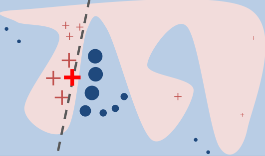

```{r setup, include=FALSE}
knitr::opts_chunk$set(echo = TRUE)
```


\  

\  

\  

\  


## Introduction

TODO

\  

\  


## Data Description

```{r include=FALSE}
predictors = read.csv(file = 'data.csv')
labels = read.csv(file = 'labels.csv')[,2]
```

The dataset was uploaded to Kaggle by/thanks to UCI Machine Learning Repository:  
https://www.kaggle.com/murats/gene-expression-cancer-rnaseq  

Source: Samuele Fiorini, samuele.fiorini@dibris.unige.it, University of Genoa, redistributed under Creative Commons license.  

The data consists of 801 patients.  

The 20532 independent variables are all RNA sequencing gene expression levels measured by a sequencing platform (Illumina HiSeq).  

The dependent categorical variable represent primary tumors occurring in different parts of the body, covering 5 tumor types including:  

* lung adenocarcinoma (LUAD)  
* breast carcinoma (BRCA)  
* kidney renal clear-cell carcinoma (KIRC)  
* colon adenocarcinoma (COAD)  
* prostate adenocarcinoma (PRAD) 

A machine learning model will be trained to predict the type of tumor for new patients.  
TODO: buscar un dataset similar pero que contenga tambien pacientes sanos.  


\newpage  


## Data Analysis and Preprocessing


```{r include=FALSE}
# keras expects the first category to be 0
# 0 BRCA
# 1 COAD
# 2 KIRC
# 3 LUAD
# 4 PRAD
cancer = as.integer(labels) - 1
```

\  

Absolute frequencies of the response:

```{r echo=FALSE, fig.width=4, fig.height=4, fig.align="center"}
barplot(table(labels), col=rainbow(15, s=0.5), ylab="Absolute frequencies", xlab="Cancer Type")
```

\  

```{r include=FALSE, fig.width=4, fig.height=3, fig.align="center"}
# removing sample name column
genes = predictors[,-1]

# a few columns only contain 0 values, these are removed
genes = genes[,colSums(genes != 0) > 0]
```


268 gene expression variables contain only 0s are removed.  

From the remaining 20264 gene expressions, 670 have at least 95% of 0s:

```{r echo=FALSE, fig.width=4, fig.height=3, fig.align="center"}
#table(stat_0s > 0.95)

stat_0s = c()
for(i in 1:ncol(genes))
  stat_0s = c(stat_0s, round(length(genes[,i][genes[,i]==0])/nrow(genes),3))

plot(density(stat_0s), main = "", xlab = "% of 0s")
```

\  

The predictors don't follow distributions close to normal. Nornality cannot be assumed:

```{r echo=FALSE, fig.width=4, fig.height=3, fig.align="center"}
# Kolmogorov-Smirnov (K-S) normality test and Shapiro-Wilk’s test.

stat_shap = c()
for(i in 1:ncol(genes))
  stat_shap = c(stat_shap,shapiro.test(genes[,i])$p.value)

plot(density(stat_shap), xlim=c(0,0.1), main = "Shapiro-Wilk’s test", xlab = "p-value")
```

\  

Symmetry and kurtosis:

```{r echo=FALSE, fig.width=4, fig.height=3, fig.align="center"}
library(moments)


stat_skew = c()
for(i in 1:ncol(genes))
  stat_skew = c(stat_skew, skewness(genes[,i]))

plot(density(stat_skew), main = "", xlim=c(-10,10), xlab = "skewness")
abline(v=0, lty=2) #normal


stat_kurt = c()
for(i in 1:ncol(genes))
  stat_kurt = c(stat_kurt, kurtosis(genes[,i]))

plot(density(stat_kurt), main = "", xlim=c(0,50), xlab = "kurtosis")
abline(v=3, lty=2) #normal
```

\  

The distribution of means suggests there are two categories of gene expression:

```{r echo=FALSE, fig.width=4, fig.height=3, fig.align="center"}
stat_mean = c()
for(i in 1:ncol(genes))
  stat_mean = c(stat_mean, mean(genes[,i]))

plot(density(stat_mean), main = "", xlab = "mean")
```

\  

Outliers:

TODO

```{r eval=FALSE, include=FALSE}
#library(rAverage)

fun <- function(x){
   quantiles <- quantile( x, c(.01, .99 ) )
   newvalues <- quantile( x, c(.05, .95 ) )
   x[ x < quantiles[1] ] <- mean(x)#newvalues[1]
   x[ x > quantiles[2] ] <- mean(x)#newvalues[2]
   x
}
```

```{r eval=FALSE, include=FALSE, fig.width=4, fig.height=3, fig.align="center"}
stat_sd = c()
for(i in 1:ncol(genes))
  stat_sd = c(stat_sd, sd(genes[,i]))

plot(density(stat_sd), main = "", xlab = "sd")
```

\  

The data is scaled to help with the training of the prediction model.  

```{r include=FALSE}
genes = scale(genes)
```

At least 45% of the variability of the data is explained by the first 10 PCA components:  

```{r echo=FALSE, message=FALSE, warning=FALSE, fig.width=5, fig.height=4, fig.align="center"}
library(factoextra)
genes_pca = prcomp(genes)
fviz_eig(genes_pca, ncp=30, addlabels=T, barfill="deepskyblue2", barcolor="deepskyblue4")
```

\  

First 4 PCs look enough to classify the types of cancer despite only accounting for 32.27% of the variability of the data, which suggests high collinearity:

```{r echo=FALSE, fig.width=3, fig.height=3}
genes_colours = rainbow(5, s=0.5)[cancer+1]

plot.new()
legend('center', bty = "n", c("BRCA","COAD","KIRC","LUAD","PRAD"), lty = 1, lwd = 2,
       col = c(rainbow(5, s=0.5)[1], rainbow(5, s=0.5)[2], rainbow(5, s=0.5)[3], rainbow(5, s=0.5)[4], rainbow(5, s=0.5)[5]))
```

```{r echo=FALSE}
pairs(genes_pca$x[,1:4], pch=19, col=genes_colours)
```


\newpage


## Predictions with a fully connected network

\  

A fully connected network is trained with 80% of the data:  

```{r include=FALSE}
library(keras)

training_index = sample(1:nrow(genes), round(nrow(genes) * 0.8))

x_train = as.matrix(genes[training_index,])
x_test = as.matrix(genes[-training_index,])

y_train = to_categorical(cancer[training_index])
y_test = to_categorical(cancer[-training_index])

black_box <- keras_model_sequential() %>% 
  layer_dense(units = 64, activation = "relu", input_shape = ncol(x_train)) %>% 
  layer_dense(units = 64, activation = "relu") %>% 
  layer_dense(units = 5, activation = "softmax")

black_box %>% compile(
  optimizer = "rmsprop",
  loss = "categorical_crossentropy",
  metrics = c("accuracy")
)

validation_index = sample(1:nrow(x_train), nrow(x_train)*0.2)

black_box_history <- black_box %>% fit(
  x_train[-validation_index,],
  y_train[-validation_index,],
  epochs = 4,
  batch_size = 32,
  validation_data = list(x_train[validation_index,],  y_train[validation_index,])
)
```

```{r echo=FALSE, message=FALSE, warning=FALSE}
plot(black_box_history)
```

\  

The accuracy of the network is close to 1 (sometimes 1 depending on the random initialization of the network):  

```{r echo=FALSE, message=FALSE, warning=FALSE}
black_box_test_pred = black_box %>% predict(x_test)
black_box %>% evaluate(x_test, y_test)
```


\newpage


## Global interpretation with a surrogate model

\  

Neural networks use to be powerful prediction tools but they come with a cost in terms of interpretability of the predictions. They contain a huge number of parameters making difficult the identification of features that are influential in the response of the model.  

To tackle the interpretability issue of the prediction model (which we'll call _black box_ from now on), a surrogate interpretable model will be fitted in parallel with the training data that was used to fit the black box. This surrogate model will help us to undestand the relationship between the features and the response at a global level (i.e. for no particular prediction).  

For the interpretable surrogate model we'll use lasso regularization, as it performs feature selection efficiently for high-dimensional data and it's very easy to understand.  

\newpage

The data representation for the interpretations can be different from the data representation used in the predictions. We could use whatever is more convenient for the interpretation, as long as we keep a mapping between both data representations.  

To get a more interpretable data representation, we do dimension reduction with PCA. This also will help with the high variance issue. The expert in the domain has to advise if the representation would be useful for interpretation. The expert might be able to understand the meaning of the main components.  

The number of components in the interpretable data representation could be reduced to a percentage of the explained variance, since probably only a few dozens of them will be really influencial. We'll start with the first 100 PCs for now.  

```{r echo=FALSE, fig.align="center", fig.height=4, fig.width=6}
#TODO: debemos hacer scale otra vez de solo con el training data antes de PCA??

x_train_pca = prcomp(x_train)
colnames(x_train_pca$x) = c("PC01","PC02","PC03","PC04","PC05","PC06","PC07","PC08","PC09",colnames(x_train_pca$x[,10:ncol(x_train_pca$x)]))
colnames(x_train_pca$rotation) = c("PC01","PC02","PC03","PC04","PC05","PC06","PC07","PC08","PC09",colnames(x_train_pca$rotation[,10:ncol(x_train_pca$rotation)]))

genes_eigenvalues = get_eigenvalue(x_train_pca)
plot(1:nrow(x_train), genes_eigenvalues$cumulative.variance.percent, xlab = "number of PCs", ylab = "cumulative variance %", type = "l")

# The number of pcs to use in the interpretable data representation:
pcs_n = 100
```

\  

Because the purpose of this model is interpretation, we'll add a parameter on top of lasso to select the number of features we want to interpret the black box model. We'll fit several models with different lambdas and pick the lambda with the desired number of selected features (or close to that number, it will depend on the given lambda range). This is done for each category. With a fixed number of features we'll be able to fairly compare the surrogate model with other models with the same number of features as we'll see later with LIME.  

In addition, the output in the lasso fitting won't be the predicted categories but the predicted probabilities, so we can better understand how the black box makes predictions.  

The 10 more influential features will be selected.  

```{r include=FALSE}
n_features = 10
black_box_train_pred = black_box %>% predict(x_train)

# !!!!! Multionomial lasso model only using predicted labels - NOT USED to get the coefficients !!!!!
get_lasso_coeffs <- function(surrogate, n_features){
  surrogate_coeffs = coef(surrogate)
  
  coeffs = vector(mode = "list", length = 5)
  names(coeffs) = c("0","1","2","3","4")
  index = coeffs
  lambda = coeffs
  
  for (i in 0:4) {
  
    # code I picked up from the LIME package: https://github.com/thomasp85/lime/blob/49df0a131deee4919a29bb6093c116b80b766d3d/R/lime.R#L22
    lasso_sparse = surrogate_coeffs[[as.character(i)]]
    has_value <- apply(lasso_sparse[-1,], 2, function(x) x != 0) 
    f_count <- apply(has_value, 2, sum)  # number of parameters for each lambda (columns in lasso_sparse)
    
    # In case that no model with correct n_feature size was found return features <= n_features
    lambda_index <- rev(which(f_count <= n_features))[1]
    
    # Selected features
    index[[as.character(i)]] = which(has_value[, lambda_index])
    coeffs[[as.character(i)]] = lasso_sparse[which(has_value[, lambda_index])+1,lambda_index]
    lambda[[as.character(i)]] = surrogate[["lambda"]][lambda_index]
  }
    
  list(index = index, coeffs = coeffs, lambda = lambda)
}

surrogate_lasso_pca = glmnet(x_train_pca$x[,1:pcs_n], cancer[training_index], alpha = 1, family = "multinomial", nlambda=300, lambda.min.ratio=0.00001)
surrogate_lasso_coeffs = get_lasso_coeffs(surrogate_lasso_pca, n_features)

coeffs_pca_lasso = setNames(data.frame(matrix(ncol = pcs_n, nrow = 0)), as.vector(sprintf("PC%i",1:pcs_n)))
colnames(coeffs_pca_lasso) = c("PC01","PC02","PC03","PC04","PC05","PC06","PC07","PC08","PC09",colnames(coeffs_pca_lasso[,10:ncol(coeffs_pca_lasso)]))

for (i in 0:4){

  lop = surrogate_lasso_coeffs[["coeffs"]][[as.character(i)]]

  for (j in 1:(length(lop)))
    coeffs_pca_lasso[i+1,names(lop)[j]] = lop[j]
}

rownames(coeffs_pca_lasso) = levels(labels)
coeffs_pca_lasso[is.na(coeffs_pca_lasso)] = 0
```


\newpage


Heatmap showing the more influential genes (selected by the lasso with optimal lambda):  

```{r echo=FALSE, fig.height=8, fig.width=5, message=FALSE, warning=FALSE}
library(glmnet)

generate_histo <- function()
{
  sparse = t(coeffs_pca_lasso)
  coeff_matrix = sparse[rowSums(sparse) != 0,] #removing rows with all surrogate_coeffs set to 0
  
  for(i in 1:nrow(coeff_matrix)){
    for(j in 1:ncol(coeff_matrix)){
      coeff_matrix[i,j] <- ifelse(coeff_matrix[i,j] < 0, -1,
                                  ifelse(coeff_matrix[i,j] > 0, 1, 0))
    }
  }
  
  # Melt de hat_betas_fd + factores
  library(reshape)
  to_plot <- coeff_matrix
  colnames(to_plot)  <- colnames(sparse)
  aux <- c()
  for(j in 1:ncol(coeff_matrix)){ # "Truco ordenación"
    aux <- c(aux, which(to_plot[,j]!=0))
  }
  aux <- rownames(to_plot)[aux]
  aux <- unique(aux)
  to_plot2 <- melt(to_plot)
  colnames(to_plot2) <- c("PC","category","value")
  to_plot2$PC <- factor(to_plot2$PC, levels = aux)
  to_plot2$category <- factor(to_plot2$category)
  to_plot2$value <- factor(to_plot2$value, levels = c(-1, 0, 1))  
  
  to_plot2$PC = as.character(to_plot2$PC)
  to_plot2 = to_plot2[order(to_plot2$PC),]
  to_plot2$PC = as.factor(to_plot2$PC)
  
  to_plot2
}

# Heatmap
library(ggplot2)

ggplot(generate_histo(), aes(x = category, y = PC, fill = value)) + 
  geom_tile() +
  scale_fill_manual(values = c("brown1", "white", "dodgerblue")) +
  theme(axis.text.y = element_text(color="black", size=8),
        axis.ticks.y.left = element_blank())
```

\  

The genes selected by the lasso give a global sense of the more influential features in driving the model. However a potential issue with high-dimensional data is the high variance in the interpretations, depending on the selected observation the influential genes will be completely different even for the same category, specially in regions of the data space that are complex (non-linear).  

\  

TODO: volver a traer the classification loss funtion

The plots above show the coefficients of the selected features for each category. The higher the absolute value, the higher the influence (globally) in the output.  

$R^2$ values are high for all the categories, but the big assumption here is that the data is linear.  

The vertical lines represent the computed lambdas 10 features (or close to 10 features). Because the number of features is fixed, the selected values for lambda are not optimal for the fitting. Not a problem since the MSE is very low for all the categories.  

TODO: que pasa si el accuracy/MSE es mucho peor que el accuracy/MSE del black box model?  


\newpage


## LIME


\  

**Intuition**  

TODO  

(image taken from https://github.com/marcotcr/lime)
```{r echo=FALSE, out.width = '80%', fig.align="center"}

```


\  

**Formulation**  

TODO  

\  

**Algorithm**  

* In order to fit a local linear model around an observation which classification we want to explain, we need enough data in the surroundings of that observation. To achieve that, kernel densities estimations are computed for each variable and sampled to "simulate" new data, reducing the sparsity of the data and therefore the variance in the local fit for the explanation.  

The parameter to tune in this step is the number of "simulated" data points (**n_permutations**).  
The risk if the parameter is too low is the high variance of the simulated data each time the prediction for a same observation is interpreted. If each time the observation is explained the simulated data is too different, the variance in the interpretation will also be high, making the interpretations inconsistent and untrustworthy.  

TODO: no veo inconveniente en incrementar este parametro al maximo hasta que las limitaciones en CPU/memoria lo permitan.  

TODO: Los estimated kernel densities de cada variable no tienen en cuenta las relaciones entre las variables lo cual puede generar data points "irreales". Idea -> usar multivariate kernel density estimation para generar un data set mas real (aplicar dimensionality reduction si es demasiado costoso).  

\  

* Of data points simulated by sampling from the features kdes, we are specially interested in those in the surroundings to the observation of interest, since we are fitting a local model. So we need to give more weight to the data close to the instance of interest and this is done with a smoothing exponential kernel. The width of the kernel is a parameter of the LIME model (**kernel_width**) and probably the more tricky one as shown in the following example of a 1-dimensional dataset:  

(image taken from https://christophm.github.io/interpretable-ml-book/lime.html)
```{r echo=FALSE, out.width = '80%', fig.align="center"}

```

In this example changes in the kernel width lead to drastic changes in the local linear fit for the instance of interest (the cross in the plot). Adding more dimensions would increase the sensitivity of the width parameter even more.  

In the _lime_ package, the default value is $0.75 \sqrt{p}$ - the more number of dimensions the more the data space is sparse and therefore the kernel width is increased depending on $p$.  
The appropriate value seems to depend on the surroundings of the data point being explained so there isn't a clear rule of thumb to follow for this parameter.  

Too small values could lead to insufficient data to fit the local model and too much variance in different interpretations for the same observation to explain.  
Too high values could lead to loosing "locality" and hence incorrect interpretations.  

TODO: Buscar algun criterio, quizas basado en la complejidad (clasificaciones con menos o mas certidumbre) para seleccionar el kernel width.  

Another parameter is the distance function that measures the proximity between the instance of interest and the simulated data points. The default option is Gower’s distance but others like Euclidean or Manhattan (see _?dist()_ for details) can also be used.  

TODO: Elegir la funcion mas adecuada teniendo en cuenta:  
- la alta dimensionalidad  
- la alta colinearidad  
- variables no-normales (pero tampoco exponenciales)  
- las variables han sido standardizadas  

\  

* The next step is to feed the black box with the simulated data to get the classifications required to fit the local model.  

\  

* With the simulated data and the corresponding predictions, a linear model is fit. Several local models are available (**feature_select**). We'll choose lasso for two reasons: the high-dimensionality of the data and to get a better comparison with the global surrogate lasso model. Lasso will use the weights from the smoothing kernel to give more influence to the neighborhood to the original observation to be explained.  

\  

* Finally the coefficients with higher absolute values are selected (**n_features**) to explain the output (**n_labels**, _1_ if we are just interested in the selected category).  


\newpage


## Interpretation with PCA

Let's use LIME to make interpretations of the predictions of individual observations in the training data with PCA reduction.  

```{r message=FALSE, warning=FALSE, include=FALSE}
library(lime)
# Setup of lime::model_type()
model_type.keras.engine.sequential.Sequential <- function(x, ...) {"classification"}
# Setup of lime::predict_model()
predict_model.keras.engine.sequential.Sequential <- function (x, newdata, type, ...) {
  pred <- predict(object = x, x = as.matrix(newdata))
  data.frame(BRCA = pred[,1], COAD = pred[,2], KIRC = pred[,3], LUAD = pred[,4], PRAD = pred[,5])
}
```

```{r echo=TRUE, fig.height=8, fig.width=8, message=FALSE, warning=FALSE}

#TODO: debo restar el mean en el data point que se pasa a lime::explain?

get_PCA_explanation <- function(datapoints_index, n_permutations = 200, kernel_width = 0.75)
{
  preprocessing <- function(x){
  
    # reversing PCA (with the remaining info) to feed the black box which only understands the original data - individual genes
    a = as.matrix(x) %*% t(x_train_pca$rotation[,1:pcs_n])
    b = t(a) + x_train_pca$center
    t(b)
  }
  
  explainer_PCA <- lime(
    x = as.data.frame(x_train_pca$x)[,1:pcs_n],
    model = black_box,
    use_density = TRUE,
    preprocess = preprocessing,
    bin_continuous = FALSE
  )

  lime::explain(
    # converting train data coordinates to the PCA space:
    x = as.data.frame(x_train[datapoints_index,] %*% x_train_pca$rotation[,1:pcs_n]),
    explainer = explainer_PCA, 
    n_permutations = n_permutations,
    #kernel_width = kernel_width,
    feature_select = "lasso_path",
    n_features = 10,
    n_labels = 1
  )
}
```

```{r eval=FALSE, include=FALSE}
# proving adding more data points doesn't impact the original data points in the PCA reversal
# only the information lost in the compression is missing after the PCA reversal
extended = genes_pca$x
for (i in 1:500) extended = rbind(extended,rep(1,nrow(genes)))

reverse = t(t(extended %*% t(genes_pca$rotation)) + genes_pca$center)
reverse_pca = prcomp(reverse)

par(mfrow=c(1,2))
plot(genes_pca$x[,7:8], pch=19, col=genes_colours)
plot(reverse_pca$x[,7:8], pch=19, col=genes_colours)
par(mfrow=c(1,1))
```

\  

We analyse the consistency in the interpretations by plotting the more influential components eight times for the same observation. The test is done with two categories: PRAD (this category barely overlaps with other categories) and LUAD (this category overlaps with other categories as seen in the PCA plots - it's harder to predict).  

```{r echo=FALSE, fig.height=5, fig.width=5, message=FALSE, warning=FALSE}
lime_PCA_PRAD = get_PCA_explanation(rep(which(cancer[training_index] == 4)[1],8))  # training_index was random
lime_PCA_LUAD = get_PCA_explanation(rep(which(cancer[training_index] == 3)[1],8))

par(mfrow=c(1,2))
plot_explanations(lime_PCA_PRAD)
plot_explanations(lime_PCA_LUAD)
par(mfrow=c(1,1))
```

\  

Some observations:  

* The plots show that the interpretations are consistent.  

* There is more variance in the selection of the components for PRAD (easier to predict), probably because the influence is concentrated in just one component (PC3) compared to LUAD.  

* $R^2$ is high in both categories, specially with category PRAD:  

```{r echo=FALSE, message=FALSE, warning=FALSE}
cat("\nR^2 mean for PRAD:\n")
round(mean(lime_PCA_PRAD$model_r2),4)

cat("\nR^2 mean LUAD:\n")
round(mean(lime_PCA_LUAD$model_r2),4)
```


\  

We now check the correlation between the global surrogate model and the local lime models of all the observations in all the categories, using the training data and 2000 permutations for each observation.  


```{r message=FALSE, warning=FALSE, include=FALSE}
get_category_coeffs <- function(category, n_permutations = 2000)
{
  datapoints_index = which(cancer[training_index] == category)
  
  explanation_PCA = get_PCA_explanation(datapoints_index[1],n_permutations)
  
  for (i in 2:length(datapoints_index))
  {
    temp = get_PCA_explanation(datapoints_index[i],n_permutations)
    temp$case = i
    explanation_PCA = rbind(explanation_PCA, temp)
  }

  explanation_PCA_cases = tidyr::nest(explanation_PCA, key = -case)
  
  coeffs_cat = setNames(data.frame(matrix(ncol = pcs_n, nrow = 0)), as.vector(sprintf("PC%i",1:pcs_n)))
  colnames(coeffs_cat) = c("PC01","PC02","PC03","PC04","PC05","PC06","PC07","PC08","PC09",colnames(coeffs_cat[,10:ncol(coeffs_cat)]))
  coeffs_names = vector()
  
  for (i in 1:nrow(explanation_PCA_cases)) {
    
    c = explanation_PCA_cases[[2]][[i]]
    
    for (j in 1:length(c$feature))
      coeffs_cat[i,c$feature[j]] = c$feature_weight[j]
    
    coeffs_names = c(coeffs_names, paste(levels(labels)[category+1],explanation_PCA_cases$case[i]))
  }
  
  rownames(coeffs_cat) = coeffs_names
  coeffs_cat[is.na(coeffs_cat)] = 0
  
  coeffs_cat
}

coeffs_BRCA = get_category_coeffs(0)
coeffs_COAD = get_category_coeffs(1)
coeffs_KIRC = get_category_coeffs(2)
coeffs_LUAD = get_category_coeffs(3)
coeffs_PRAD = get_category_coeffs(4)
```

```{r message=FALSE, warning=FALSE, include=FALSE}
gc()
```

The coefficients of the selected features in the interpretations of all the observations for the same category are summarized in a single list of component coefficients. Each summarized component coefficient will be computed with a statistic describing the central tendency of the coefficient across the observations.  

To decide which statistic to use we analyse the more influential features for each category. To measure the influence we use the sum of the absolute values of the coefficients of all the observations for each component.  

```{r echo=FALSE, fig.height=7, fig.width=6, message=FALSE, warning=FALSE}
library(wordspace)
library(gplots)

abs_sums_BRCA = apply(abs(coeffs_BRCA), 2, sum)
abs_sums_COAD = apply(abs(coeffs_COAD), 2, sum)
abs_sums_KIRC = apply(abs(coeffs_KIRC), 2, sum)
abs_sums_PRAD = apply(abs(coeffs_PRAD), 2, sum)
abs_sums_LUAD = apply(abs(coeffs_LUAD), 2, sum)

plot_coeff_abssum <- function()
{
  m = as.matrix(abs_sums_BRCA)
  m = cbind(m, as.matrix(abs_sums_COAD))
  m = cbind(m, as.matrix(abs_sums_KIRC))
  m = cbind(m, as.matrix(abs_sums_LUAD))
  m = cbind(m, as.matrix(abs_sums_PRAD))
  colnames(m) = c("BRCA","COAD","KIRC","LUAD","PRAD")
  
  m = normalize.cols(m)
  m = m[1:30,]
  
  par(cex.main=0.7)
  heatmap.2(m, col= colorRampPalette(c("white","blue"))(n = 99), breaks=seq(0,1,length=100), symkey=FALSE, key=TRUE, Rowv=F, Colv=F, cexCol =1, srtCol=45, main="Sum of absolute values\n of component coefficients (normalized)")
}

plot_coeff_abssum()
```

\  

Below are displayed the distributions of the 16 more influential components for all the categories. The vertical red line represents the mean, the blue one represents the median.  

```{r echo=FALSE, fig.align="center", fig.height=6, fig.width=10, message=FALSE, warning=FALSE}
infl_comp_COAD = sort(abs_sums_COAD, decreasing = TRUE)[1:16]
infl_comp_BRCA = sort(abs_sums_BRCA, decreasing = TRUE)[1:16]
infl_comp_KIRC = sort(abs_sums_KIRC, decreasing = TRUE)[1:16]
infl_comp_PRAD = sort(abs_sums_PRAD, decreasing = TRUE)[1:16]
infl_comp_LUAD = sort(abs_sums_LUAD, decreasing = TRUE)[1:16]

library(tidyr)
library(purrr)
library(ggplot2)

print_distributions <- function(co, infl, le)
{
  means = apply(co, 2, mean)
  medians = apply(co, 2, median)
  key = names(infl)[1:16]

  co[,key] %>%
  keep(is.numeric) %>% 
  gather(key) %>% 
  ggplot(aes(value)) +
  facet_wrap(~ factor(key, levels=names(infl)[1:16]), scales = "free") + 
  geom_density() + 
  geom_rug(colour="red") +
  geom_vline(xintercept=means[key], size=0.5, color="red") + 
  geom_vline(xintercept=medians[key], size=0.5, color="blue") + 
  ggtitle(sprintf("16 more influential components for %s classification",le)) + 
  theme(plot.title = element_text(hjust = 0.5))
}

print_distributions(coeffs_BRCA,infl_comp_BRCA,"BRCA")
print_distributions(coeffs_COAD,infl_comp_COAD,"COAD")
print_distributions(coeffs_KIRC,infl_comp_KIRC,"KIRC")
print_distributions(coeffs_LUAD,infl_comp_LUAD,"LUAD")
print_distributions(coeffs_PRAD,infl_comp_PRAD,"PRAD")
```

\  

We can see that the more influential components are more or less symmetric, whereas the less influentual ones are bimodal, one of the modes lying on value 0 which represents the absence of influence for a subset of observations.  

To avoid the components that only appear as influential for a few observations (and when they are included in the list of 10 more important components their value is very small) we use the median to compute the representing value of the component coefficient for the whole category. The median will ignore components that come up rarely and have small values by setting them to 0 in the summarize component coefficient.  

We compute a single set of coefficients for each category using the median of the components coefficients from all the observations for both categories, and get a histogram to compare them with the surrogate lasso model coefficients:  

```{r echo=FALSE, fig.height=9, fig.width=6, message=FALSE, warning=FALSE}
#library(unikn)

plot_stat_coeffs <- function(fun,legend)
{
  coeffs_pca = apply(coeffs_BRCA, 2, fun)
  coeffs_pca = cbind(coeffs_pca,apply(coeffs_COAD, 2, fun))
  coeffs_pca = cbind(coeffs_pca,apply(coeffs_KIRC, 2, fun))
  coeffs_pca = cbind(coeffs_pca,apply(coeffs_LUAD, 2, fun))
  coeffs_pca = cbind(coeffs_pca,apply(coeffs_PRAD, 2, fun))

  # removing rows with all 0s
  coeffs_pca = coeffs_pca[rowSums(coeffs_pca) != 0,]
  
  # normalizing
  library(wordspace)
  coeffs_pca = normalize.cols(coeffs_pca)
  
  max_c = max(abs(coeffs_pca))
  col_breaks = c(seq(-max_c,-0.0001,length=100),  # for red
                 seq(+0.0001,+max_c,length=100))  # for blue
  
  par(cex.main=0.7)
  my_palette <- c(colorRampPalette(c("brown1","white"))(n = 99), "white", colorRampPalette(c("white","dodgerblue"))(n = 99))
  heatmap.2(coeffs_pca[1:(min(nrow(coeffs_pca),30)),], col= my_palette, breaks=col_breaks, symkey=FALSE, key=TRUE, Rowv=NA, Colv=NA,
            srtCol=45, cexCol=1, main=legend)
}

plot_stat_coeffs(median,"Components influence (median)")
```

```{r echo=FALSE, fig.height=13, fig.width=6, message=FALSE, warning=FALSE}
plot_stat_coeffs(mean,"Components influence (mean)")
```


\newpage 

Disentangling the component coefficients of a particular observation to get the more influential individual genes:  

```{r echo=TRUE, message=FALSE, warning=FALSE}
LUAD_PCA_coords = x_train_pca$rotation[,as.matrix(lime_PCA_LUAD[lime_PCA_LUAD$case==1,"feature"])]
influential_components_weights = as.matrix(lime_PCA_LUAD[lime_PCA_LUAD$case==1,"feature_weight"])
gene_coeffs = LUAD_PCA_coords %*% influential_components_weights

influential_genes = names(sort(abs(gene_coeffs[,]), decreasing = TRUE)[1:100])
gene_coeffs[influential_genes,]
```


\newpage

Correlation heatmap of interpretations for all the observations of category LUAD:  

```{r echo=FALSE, fig.height=10, fig.width=10, message=FALSE, warning=FALSE}
library(corrplot)

plot_corr <- function()
{
  heatmap(signif(cor(t(coeffs_LUAD)),2), symm=TRUE, col=colorRampPalette(c("brown1", "white", "dodgerblue"))(20), Rowv = NA, Colv = NA)
}

plot_corr()
```


\newpage


## Interpretation with clusters of variables

A classic example of this are superpixels in the field of image classification. A superpixel represents a segment of an image that group pixeles that are interconnected and share similar colors. As opposed to individual pixels, this representation is natural for humans and simplifies the identification of specific regions that could have high influence in the classification of an image. For instance, if a machine learning model classifies the below picture as a goose, it's very likely that the superpixel representing the beak is selected in the LIME interpretation. The simulated data in this case consists in copies of the original picture where some superpixels are zeroed (set to white), so the local model is able to distinguish between superpixels that have an impact in the classification and those that are less relevant.  

(image taken from https://pbiecek.github.io/ema/LIME.html)
```{r echo=FALSE, out.extra='', out.width = '100%', fig.align="center"}

```

TODO:

* picking samples that are not close together in the imput space in order to cover different scenarios.  

* picking samples with less certainty in the output - samples that lie within the frontier between different categories are tougher to predict and therefore more intersting to understand.  

* TODO: mirar el metodo propuesto en "4.SUBMODULAR PICK FOR EXPLAINING MODELS" en el paper [1]  

probar con distintos kernel widths (distintas combinaciones: mas o menos categoryoverlap, mas o menos varianza (pcs vs all individual genes))
probar con ruido en el modelo de clusters?
buscar literatura como sobre abordar p >> n
buscar data sets especificos para cada interpretable data representation (time series con segmentos, ...)
heatmap de los parametros con distintos data points para ver donde se parece mas lime a global lasso (o algo asin)
R^2


Taking the superpixel example as inspiration we could look for a more abstract data representation easier to undestand that individual variables in our tabular data. In a picture, pixels are correlated by color similarity and by proximity in the spacial axes. In tabular data, variables could be grouped by linear correlation. The interpretable data representation would be then clusters grouping the original variables. An expert in the domain of our prediction model would be able to advise if the representation is useful.  

Clustering could be based on:  
- correlation of variables regardless the classification  
- multicollinearity using package mctest  
- some grouping based on PCA weights  
- ...  

We'll create 100 clusters based on correlation:  

TODO: hacerlo con con multicolinearidad  
TODO: mirar "grouped lasso" para comparar con las interpretaciones de grupos de genes muy correlacionados.  

```{r echo=TRUE, message=FALSE, warning=FALSE}
library(ClustOfVar)
#TODO: dig more into this package (hclustvar, ...)
#TODO: other libraries: corclust

num_clusters = 100
kmeansvar = kmeansvar(X.quanti = as.matrix(genes), X.quali = as.matrix(as.factor(cancer)), init = num_clusters, iter.max = 1, matsim = FALSE) # nstart = 1, 

clusters = kmeansvar$cluster
clusters = clusters[1:(length(clusters)-1)]  #X.quali column?
```

\  

80% of the clusters will be randomly zeroed in each simulated data point in order for the model to find relevant clusters for the classification of the instance of interest.  

```{r echo=TRUE, message=FALSE, warning=FALSE}
# "p is the percentage of non-zeroed clusters to use in each simulated data point
get_cluster_explanation <- function(datapoint_index, p = 0.2, n_permutations = 500)
{
  # the instance of interest to interpret
  instance = as.data.frame(x_test)[datapoint_index,]

  preprocessing <- function(x) {

    # the instance of interest is replicated n_permutations times
    toblackbox = instance[rep(1, nrow(x)),]

    # then, 0s are set for all the variables contained in an inactive cluster
    # (the permutations will randomly active p% of the clusters of each simulated data point)
    for (i in 1:nrow(x)) {
  
      for (k in 1:ncol(x))
      {
        if (!x[i,k])
          toblackbox[i,names(clusters[clusters == k])] = 0
        
        # alternatively, variable means instead of 0s (doesn't change the result too much):
        #vars_in_cluster = names(clusters[clusters == k])
        #  
        #if (length(vars_in_cluster) > 1)
        #  toblackbox[i,names(clusters[clusters == k])] = apply(x_train[,vars_in_cluster], 2, mean)
        #else
        #  toblackbox[i,names(clusters[clusters == k])] = mean(x_train[,vars_in_cluster])
      }
    }

    as.matrix(toblackbox)
  }

  # 
  sim_dist = as.data.frame(matrix(FALSE, nrow = 100, ncol = num_clusters))
  sim_dist[1:round(p*100),] = TRUE
  
  for (i in 1:num_clusters)
    colnames(sim_dist)[i] = as.character(sprintf("cluster_%s",i))
  
  explainer_cluster <- lime(
    x = as.data.frame(sim_dist),
    model = black_box,
    use_density = TRUE,
    preprocess = preprocessing,
  )
  
  # vector of active clusters (all 1s for the instance of interest)
  all_ones = as.data.frame(matrix(TRUE, nrow = 1, ncol = num_clusters))
  for (i in 1:num_clusters)
    colnames(all_ones)[i] = as.character(sprintf("cluster_%s",i))
  
  lime::explain(
    x = all_ones,
    explainer = explainer_cluster, 
    n_permutations = n_permutations,
    #kernel_width = 0.75,
    feature_select = "lasso_path",
    n_features = n_features,
    n_labels = 1
  )
}

# PRAD category
#plot_features(get_cluster_explanation(which(cancer[-training_index] == 4)[1]))

# LUAD category
plot_features(get_cluster_explanation(which(cancer[-training_index] == 3)[1]))
```

```{r}
library(msgl)

fr_fit = msgl::cv(x_train, cancer[training_index], grouping = clusters, standardize = FALSE, lambda = 0.001)
```


```{r}
#cols=brewer.pal(5,name="Set1")

plot(fr_fit$b0,main="Coefficient vs Step",
     ylab="Intercept",
     lab="Step (decreasing Lambda =>)",
     #col=cols[1],
     #xlim=c(-1,100),
     #ylim=c(5,max(fr_fit$b0)),
     type="l",lwd=4)
```


```{r eval=FALSE, include=FALSE}
- returned object (original data)
case - rowname of the data point
data - data point values
feature_value
prediction - original prediction from the black box model

- returned object (prediction model)
prediction - original prediction from the black box model
label_prob
label

- returned object (explanation model)
model_r2
model_intercept
model_prediction
feature
feature_weight
how about the predictions of the explanation model? could it be a difference between the prediction and the explanation model for the selected category? Creo que en realidad eso no tiene mucha importancia.

Analizar:
buscar similitudes entre LASSO y LIME, some plot showing correlation between LIME and LASSO
- Creo que para ser justos deberíamos utilizar LIME con todas las observaciones de entrenamiento para predecir sólo la clase que nos da el modelo de entrenamiento, y con un número de features igual al número de betas diferentes de 0 que tenemos en el LASSO para esa clase (TAREA 4)
elastic net (0.5)?

intercetps? important? meaning?


- - - - - - - - - - - - - - - - - - - - - - - - - - - - - - - - - - - -
  
  
Trying with different kernel widths / distance functions


As you saw in the above plot_features() plot, the output provides the model fit. In this case the best simple model fit for the given local regions was R^2 = 0.59 for case 3. Considering there are several knobs we can turn when performing the LIME algorithm, we can treat these as tuning parameters to try find the best fit model for the local region. This helps to maximize the amount of trust we can have in the local region explanation.

As an example, the following changes the distance function to use the manhattan distance algorithm, we increase the kernel width substantially to create a larger local region, and we change our feature selection approach to a LARS lasso model. The result is a fairly substantial increase in our explanation fits.

plot_features(get_PCA_explanation(rep(which(cancer[training_index] == 3)[1],4),5000,0.25))
plot_features(get_PCA_explanation(rep(which(cancer[training_index] == 3)[1],4),5000,0.50))
plot_features(get_PCA_explanation(rep(which(cancer[training_index] == 3)[1],4),5000,0.75))
plot_features(get_PCA_explanation(rep(which(cancer[training_index] == 3)[1],4),5000,1.25))
plot_features(get_PCA_explanation(rep(which(cancer[training_index] == 3)[1],4),5000,1.75))
plot_features(get_PCA_explanation(rep(which(cancer[training_index] == 3)[1],4),5000,3))
plot_features(get_PCA_explanation(rep(which(cancer[training_index] == 3)[1],4),5000,5))
plot_features(get_PCA_explanation(rep(which(cancer[training_index] == 3)[1],4),5000,10))


- - - - - - - - - - - - - - - - - - - - - - - - - - - - - - - - - - - -

**Is the explanation good?**

The resulting model can then be used to explain the predictions of the more complex model at the locality of the observation of interest.
If R^2 is poor we shouldn’t put too much faith in the explanation.
If R^2 is poor but with little simulated data, should we still put faith?

The expert will give feedback to se if the result make sense and we can trust the black model. What if we need to change the LIME parameters?

The fidelity measure (how well the interpretable model approximates the black box predictions) gives us a good idea of how reliable the interpretable model is in explaining the black box predictions in the neighborhood of the data instance of interest. (is this r^2?)

The correct definition of the neighborhood is a very big, unsolved problem when using LIME with tabular data. In my opinion it is the biggest problem with LIME and the reason why I would recommend to use LIME only with great care. For each application you have to try different kernel settings and see for yourself if the explanations make sense. Unfortunately, this is the best advice I can give to find good kernel widths. (no hay error que minimizar)

The complexity of the explanation model (like the number of explanatory variables?) has to be defined in advance. This is just a small complaint, because in the end the user always has to define the compromise between fidelity and sparsity.

Another really big problem is the instability of the explanations. In an article 38 the authors showed that the explanations of two very close points varied greatly in a simulated setting. Also, in my experience, if you repeat the sampling process, then the explantions that come out can be different. Instability means that it is difficult to trust the explanations, and you should be very critical.

_[2] Our choice of G (glass-box sparse linear models) means that if the underlying model is highly non-linear even in the locality of the prediction, there may not be a faithful explanation.  However, we can estimate the faithfulness of the explanation on Z, and present this information to the user. This estimate of faithfulness can also be used for selecting an appropriate family of explanations from a set of multiple interpretable model classes, thus adapting to the given dataset and the classifier. We leave such exploration for future work, as linear explanations work quite well for multiple black-box models in our experiments._

Considering there are several knobs we can adjust when performing LIME, we can treat these as tuning parameters to try to tune the local model. This helps to maximize the amount of trust we can have in the local region explanation. As an example, the following code block changes the distance function to be Euclidean, increases the kernel width to create a larger local region, and changes the feature selection approach to a LARS-based LASSO model.
The result is a fairly substantial increase in our explanation fits, giving us much more confidence in their explanations.

## References

[1] Ribeiro, Marco Tulio, Sameer Singh, and Carlos Guestrin. 2016. “Why Should I Trust You?: Explaining the Predictions of Any Classifier.” In Proceedings of the 22nd Acm Sigkdd International Conference on Knowledge Discovery and Data Mining, 1135–44. ACM.

[2] Przemyslaw Biecek and Tomasz Burzykowski. 2020. “Explanatory Model Analysis: Explore, Explain and Examine Predictive Models.” E-Book At< https://pbiecek.github.io/ema/>.

[3] Molnar, Christoph, and others. 2018. “Interpretable Machine Learning: A Guide for Making Black Box Models Explainable.” E-Book At< Https://Christophm.github.io/Interpretable-Ml-Book/>.

LIME Python code:  
https://github.com/marcotcr/lime

Port in R:  
https://github.com/thomasp85/lime

```


