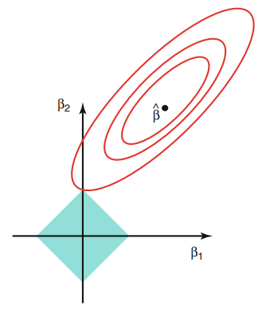
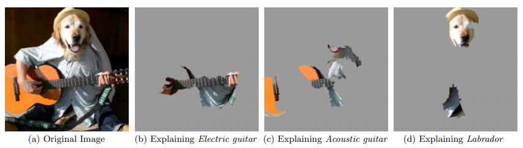

```{r eval=TRUE, include=FALSE}
knitr::opts_chunk$set(eval = FALSE)
knitr::opts_chunk$set(echo = FALSE)
knitr::opts_chunk$set(message = FALSE)
knitr::opts_chunk$set(warning = FALSE)
knitr::opts_chunk$set(fig.align = "center")
```

```{r}
save.image("data.RData")
```

```{r eval=TRUE}
load("data.RData")
```

```{r eval=TRUE}
library(moments)
library(factoextra)
library(keras)
library(glmnet)
library(reshape)
library(gplots)
library(ggplot2)
library(lime)
library(wordspace)
library(tidyr)
library(purrr)
library(mice)
library(MASS)
library(caret)
```


\newpage


## Introduction

\  

AI, machine learning, big data, ... sometimes become buzzwords in an attempt by the press to depict the technology as something revolutionary or even mystical. Often companies use the same words for marketing purposes, to present themselves as highly sophisticated when sometimes it's not even clear if they are achieving anything really meaningful to improve their services through AI.
Despite the need to keep the expectations down to earth, machine learning is already providing tangible results in a wide range of problems, it's becoming increasingly important and a norm in many industries. Private investment is accelerating and governments around the world are also pouring money into what is considered a strategic sector. The momentum is there and it seems unlikely to stop.

One of the main strong points of machine learning is its potential to add value in almost every known domain. Wherever there is data, machine learning can step in and help to take better decision, from improving the personal assistance of your mobile to helping in the prevention of diseases. This is why data is sometimes referred to as the "new electricity", the prospect of a future society that will greatly depend on consuming data through AI technology in every aspect of its everyday life.
This potential feature of ubiquity of machine learning highlights the importance of understanding how decisions are taken, specially in applications involving sensitive areas such as health, privacy or social fairness, where trust needs to be built before the technology is fully adopted. In that spirit, the EU introduced recently what is commonly known as the "right to explanation" in the GDPR regulation:

_(71) The data subject should have the right not to be subject to a decision, which may include a measure, evaluating personal aspects relating to him or her which is based solely on automated processing and which produces legal effects concerning him or her or similarly significantly affects him or her, such as automatic refusal of an online credit application or e-recruiting practices without any human intervention. [1]_

Being able to explain the decisions of ML models is not just a matter of complying with regulation, it can also be an engineering tool to detect faults that otherwise would go unnoticed. For instance, lack of diversity in the data (or just not enough data) could make overfitting detection a hard task. The examination of the decisions could help to identify the problem in a qualitative way (e.g. is your image classifier focusing on the object related to the predicted label, or is the decision actually based on something in the background that happens to be correlated to the label in the data). Lack of generalization could also be exploited in adversarial attacks, a concern in fields like cybersecurity or automated driving. It's clear that the more interpretable the model is, the easier these problems can be avoided.

\  

### Motivation

When it comes to choosing and tuning a model to predict / explain data, we always face the predictability vs interpretability trade-off, naturally impossible to avoid. Sometimes a simpler model easy to explain is good enough, in other cases we don't want to forgo the prediction performance of a more opaque model. In this project we'll focus on the later case and will aim to close the predictability vs interpretability trade-off as much as we can. To try to achieve it, we'll resort to a second model to explain the predictions, that is, we'll handle two models: a prediction model which consumes data to make predictions in the domain of interest, and an interpretable model which receives the prediction model as input to make interpretations of its decisions.

More specifically, the motivation of this project is to explore how to obtain meaningful interpretations in the following real-world setup:

* A classification problem with tabular data. Tabular data is very common in many different domains.

* A dataset with a large number of independent variables. Having to deal with high-dimensional data is specially challenging in terms of interpretability, the higher the number of independent variables, the higher the variance in the universe of explanations and therefore the more valuable would be a robust interpretation method.

* An optimal prediction model. In general opaque models predict better for complex data than simple models, but it comes at a price, their outcomes are harder to explain. We'll use neural network models with tens of thousands of parameters to classify the data, making difficult the identification of features that are influential in the response of the model.

\  

### Interpretable models

The interpretable model in the scope of this project must have the following properties:

* It must be model-agnostic, a model that only uses the input and the output of the prediction model, not caring about the prediction model itself. This independence could come in handy if at some point the prediction model has to be replaced with some other model performing better, something not unusual in the constantly changing field that is ML. The model-agnostic interpretable model will always remain valid at no development cost.

* It must be capable of dealing with the large number of features in the data. Namely it should be able to provide certain degree of interpretability by simplifying the high-dimensional data space, and it should be reassuring in its interpretations: they should make sense from a human perspective, several interpretations for the same observation should be consistent, etc 

* In addition, we want to be able to analyze the interpretations both at a global scale (how the prediction model behaves in general) and at a local scale (explaining the classifications for particular observations of interest in particular local regions of the data). Understanding the prediction model from both perspectives and their relationship is key to get a complete vision of the interpretations and gain trust in the interpretable model.

The LASSO (least absolute shrinkage and selection operator) is well suited for these requirements. It can operate in parallel with the prediction model by only using its inputs and outputs. It performs regularization and feature selection to deal with high-dimensionality and it can be fit locally, even in sparse local regions of the data, with the help of LIME (Local Interpretable Model-Agnostic Explanations) as we'll see later.


 


\newpage


## Datasets

\  

The implementation of the models will be tested with two different datasets to contrast the results. Both datasets contain a large number of features, being one of them very sparse.

\  

### Genes dataset

The data consists of 801 patients with tumors occurring in different parts of the body. The tumor types covered include: lung adenocarcinoma (LUAD), breast carcinoma (BRCA), kidney renal clear-cell carcinoma (KIRC), colon adenocarcinoma (COAD) and prostate adenocarcinoma (PRAD).

```{r}
genes_features = read.csv(file = 'genes.csv')
cancer_labels = read.csv(file = 'cancer.csv')[,2]

# keras expects the first category to be 0
# 0 BRCA
# 1 COAD
# 2 KIRC
# 3 LUAD
# 4 PRAD
cancer = as.integer(cancer_labels) - 1

# removing sample name column
genes = genes_features[,-1]

# a few columns only contain 0 values, these are removed
genes = genes[,colSums(genes != 0) > 0]
```

```{r eval = TRUE, fig.width=3.5, fig.height=2.7}
genes_colours = rainbow(5, s=0.5)
barplot(table(cancer_labels), col=genes_colours, main="Absolute frequencies of the response", xlab="", cex.main=0.7, cex.axis=0.7, cex.sub=0.7, cex.names = 0.7)
```

Among more than 20000 RNA sequencing gene expression levels, the goal is to identify which genes could have been altered through mutation causing the condition.

The distribution of values for each gene expression in the dataset is symmetric in general but not normal. In addition, the distribution of means suggests there are two categories of gene expressions.

```{r eval = TRUE, fig.width=7, fig.height=4.5}
plot_stat_dists_genes <- function()
{
  stat_skew = c()
  for(i in 1:ncol(genes))
    stat_skew = c(stat_skew, skewness(genes[,i]))
  
  plot(density(stat_skew), main = "Skewness distribution", xlab = "skewness", cex.main=0.7, cex.axis=0.7, cex.sub=0.7, xlim=c(-10,10))
  abline(v=0, lty=2) #normal
  
  
  stat_kurt = c()
  for(i in 1:ncol(genes))
    stat_kurt = c(stat_kurt, kurtosis(genes[,i]))
  
  plot(density(stat_kurt), main = "Kurtosis distribution", xlab = "kurtosis", cex.main=0.7, cex.axis=0.7, cex.sub=0.7, xlim=c(0,25))
  abline(v=3, lty=2) #normal

  stat_shap = c()
  for(i in 1:ncol(genes))
    stat_shap = c(stat_shap,shapiro.test(genes[,i])$p.value)
  
  plot(density(stat_shap), main = "Shapiro-Wilk’s test distribution", xlab = "p-value", cex.main=0.7, cex.axis=0.7, cex.sub=0.7, xlim=c(0,0.05))
    
  stat_mean = c()
  for(i in 1:ncol(genes))
    stat_mean = c(stat_mean, mean(genes[,i]))
  
  plot(density(stat_mean), main = "Mean distribution", xlab = "mean", cex.main=0.7, cex.axis=0.7, cex.sub=0.7, cex.lab=0.7)
}

par(mfrow = c(2,2))
plot_stat_dists_genes()
par(mfrow = c(1,1))
```

\  

The data is scaled to help with the training of the prediction model and the interpretations. At least 45% of the variance of the data is explained by the first 10 PCA components. The explained variance concentration in the PCA components, plus having more than 20000 gene expressions and only 5 categories suggests high multicollinearity.

```{r}
all_genes_pca = prcomp(scale(genes))
```

```{r eval = TRUE, fig.width=10, fig.height=4.1}
fviz_eig(all_genes_pca, ncp=20, addlabels=T, barfill="lightblue", barcolor="black", main = "")
```

\  

First 4 PCs look enough to classify the types of cancer despite only accounting for a third of the variability of the data:

```{r eval = TRUE, fig.width=8, fig.height=5}
pairs(all_genes_pca$x[,1:4], pch=19, col=genes_colours[cancer+1])
par(xpd = TRUE)
legend('bottomright', legend=c("BRCA","COAD","KIRC","LUAD","PRAD"), lty = 1, lwd = 2, cex=0.7, 
       col = c(rainbow(5, s=0.5)[1], rainbow(5, s=0.5)[2], rainbow(5, s=0.5)[3], rainbow(5, s=0.5)[4], rainbow(5, s=0.5)[5]))
```

\  

Classifications are done with a fully connected network with one hidden layer.  
The accuracy of the network is close to 1 and the categorical cross-entropy loss is close to 0:

```{r}
training_index = sample(1:nrow(genes), nrow(genes)*0.8)

x_train_g = as.matrix(scale(genes[training_index,]))
x_test_g = as.matrix(scale(genes[-training_index,], center = colMeans(genes[training_index,]), scale = apply(genes[training_index,],2,sd)))

# instability with the scaling on high dimension, 3 columns are lost
x_train_g = x_train_g[,colSums(x_train_g != 0) > 0]
x_train_g = x_train_g[,colSums(is.na(x_train_g)) == 0]
x_test_g = x_test_g[,colnames(x_train_g)]

y_train_g = to_categorical(cancer[training_index])
y_test_g = to_categorical(cancer[-training_index])
```

```{r eval = TRUE, include=FALSE}
black_box_g <- keras_model_sequential() %>% 
  layer_dense(units = 64, activation = "relu", input_shape = ncol(x_train_g)) %>% 
  layer_dense(units = 64, activation = "relu") %>% 
  layer_dense(units = 5, activation = "softmax")

black_box_g %>% compile(
  optimizer = "rmsprop",
  loss = "categorical_crossentropy",
  metrics = c("accuracy")
)

black_box_history_g <- black_box_g %>% fit(
  x_train_g,
  y_train_g,
  epochs = 4,
  batch_size = 32,
  validation_data = list(x_test_g,  y_test_g)
)
```

```{r eval = TRUE}
black_box_history_g
```

```{r}
# Predictions with LASSO would give accuracy of 1 - why are we using a neural network model then??
cvfit_g = cv.glmnet(x_train_g, cancer[training_index], alpha = 1, family = "multinomial")
cvfit_g_coef = coef(cvfit_g)

y_test_pred_lasso_g = predict(cvfit_g, newx = x_test_g, s = cvfit_g$lambda.min, type="response")
y_test_pred_lasso_g = max.col(as.data.frame(y_test_pred_lasso_g))-1
mean(cancer[-training_index] == y_test_pred_lasso_g)
```

\  

\  

### Proteins dataset

TODO: Description y analisis

The 9972 observations are proteins that are candidates for having anti-freezing properties. The goal is to identify which observations are antifreeze proteins (AFPs), important for the survival of animals, plants, fungi and bacteria in extreme cold environment conditions.

The 841 features represent attributes of the molecule structure (amino acid and di-peptide compositions).

```{r}
proteins_train = read.csv(file = 'proteins_train.csv')
proteins_train_x = proteins_train[,2:ncol(proteins_train)]
proteins_train_y = proteins_train[,1]

proteins_test = read.csv(file = 'proteins_test.csv')
```

```{r}
x_train_p = as.matrix(scale(proteins_train[,2:ncol(proteins_train)]))
y_train_p = ifelse(proteins_train[,1] == "AFP",1,0)

x_test_p = as.matrix(scale(proteins_test[,2:ncol(proteins_test)], center = colMeans(proteins_train[,2:ncol(proteins_train)]), scale = apply(proteins_train[,2:ncol(proteins_train)],2,sd)))
y_test_p = ifelse(proteins_test[,1] == "AFP",1,0)
```

```{r}
protes_train_pca = prcomp(scale(proteins_train_x))
```

```{r eval = TRUE, fig.width=10, fig.height=4.1}
fviz_eig(protes_train_pca, ncp=20, addlabels=T, barfill="lightblue", barcolor="black", main = "")
```

\  

Classifications are done with a fully connected network with one hidden layer. The training data is down-sampled to deal with the imbalanced data - only 0.018% of proteins are AFPs.   
The accuracy of the network is above 0.8, with balanced sensitivity / specificity.  
TODO: analizar si es mejor evitar mas los falsos positivos

```{r eval = TRUE, include=FALSE}
black_box_p <- keras_model_sequential() %>% 
  layer_dense(units = 16, activation = "relu", input_shape = ncol(x_train_p)) %>% 
  layer_dropout(0.6) %>%
  layer_dense(units = 32, activation = "relu") %>% 
  layer_dropout(0.5) %>%
  layer_dense(units = 1, activation = "sigmoid")

black_box_p %>% compile(
  optimizer = optimizer_sgd(lr = 2),
  loss = "binary_crossentropy",
  metrics = c("accuracy","FalseNegatives","FalsePositives")
)

black_box_history_p <- black_box_p %>% fit(
  x_train_p,
  y_train_p,
  #class_weight = as.list(c("0"=0.019, "1"=0.981)),   # if test data is use to fit the model, the classes are unbalanced
  class_weight = as.list(c("0"=0.4, "1"=0.6)),
  epochs = 16,
  batch_size = 200,
  validation_data = list(x_test_p, y_test_p)
)
```

```{r eval = TRUE}
#black_box_history_p
y_test_pred_p = as.integer((black_box_p %>% predict(x_test_p)) > 0.5)
print(confusionMatrix(table(as.integer(y_test_pred_p), y_test_p)[2:1,2:1]))
```

```{r}
# Predictions with LASSO performs worse

x_train_p = as.matrix(proteins_train_x)
y_train_p = proteins_train_y

# Downsampling the dominant category (nonAFP) - if test data is use to fit the model
#nonAFP = proteins_train[proteins_train_y==0,]
#AFP = proteins_train[proteins_train_y==1,]
#x_train_p = as.matrix(rbind(AFP, nonAFP[sample(1:nrow(nonAFP),nrow(AFP)),]))
#y_train_p = c(rep(1,nrow(AFP)), rep(0,nrow(AFP)))

shuffle = sample(nrow(x_train_p))
cvfit_p = cv.glmnet(x_train_p[shuffle,], y_train_p[shuffle], alpha = 1, family = "binomial")
# Note that glmnet automatically scales the data

# Performance test
x_test_p = as.matrix(scale(proteins_test[,2:ncol(proteins_test)], center = colMeans(x_train_p), scale = apply(x_train_p,2,sd)))
y_test_p = proteins_test[,1]

#y_test_pred_p = as.integer(predict(cvfit_p, newx = x_test_p, s = cvfit_p$lambda.min, type="response") > 0.5)
y_test_pred_p = as.factor(as.integer(predict(cvfit_p, newx = x_test_p, s = cvfit_p$lambda.min, type="response") > 0.5))
levels(y_test_pred_p) = levels=levels(y_test_p)
print(confusionMatrix(table(y_test_pred_p, y_test_p)[2:1,2:1]))
```


\newpage


## Global surrogate model

\  

A surrogate model is an interpretable model that tries to mimic a non-interpretable model. The surrogate model is fit with the features of the training data and the outputs of the non-interpretable model, its role is not to make predictions but to provide a way to understand how the non-interpretable model makes predictions. The result is an approximation of the non-interpretable model that helps to identify the features in the data that drive the predictions of the non-interpretable model (which we'll call _black box_ from now on) at a global level (i.e. for no particular prediction).

When the surrogate model is fit, overfitting is not something to avoid but rather welcomed since we want to get a good approximation of the black box (which already should have took care of properly generalizing the data). However there is a trade-off between how well the interpretable model fits the black box and the degree of interpretability of the interpretale model. This is known as the fidelity vs interpretability trade-off [2].

\  

### The lasso

We humans have a hard time dealing with large number of variables at the same time, we have to use abstraction to be able to cope with all the information in an effective way, although introducing all sort of biases in the process. The philosophy behind lasso is somewhat similar, lasso performs feature selection and improves accuracy in high-dimensional data by greatly decreasing variance but also introducing some bias. This makes lasso a good candidate for a global surrogate model that helps us to focus on the bunch of features that are really important to explain the black box outcome.

Lasso is a well known model, it performs regularization by introducing a coefficient penalization component. An intuitive way to understand how lasso works is seeing it as a linear optimization problem where the vertices of the constraint shape lie on axis intersections where some variables are set to zero due to the absolute value function in the penalization.

\  

\  

```{r eval = TRUE, out.width = '30%'}

```

\newpage

With more than 20k variables, the genes dataset is quite an extreme case. The aim is to reduce the number of features to a bunch we can handle. It turns out that by fitting the surrogate lasso model with an optimal lambda, the number of features selected by lasso is indeed small.

```{r}
get_lasso_explainer <- function(surrogate, wanted_n_features = 50){
  
  surrogate_coeffs = coef(surrogate)
  
  coeffs = vector(mode = "list", length = 5)
  names(coeffs) = c("0","1","2","3","4")
  index = coeffs
  lambda = coeffs
  r2 = coeffs
  
  for (i in 0:4) {
  
    # Code I picked up from the LIME package: https://github.com/thomasp85/lime/blob/49df0a131deee4919a29bb6093c116b80b766d3d/R/lime.R#L22
    lasso_sparse = surrogate_coeffs[[as.character(i)]]
    has_value = apply(as.matrix(lasso_sparse[-1,]), 2, function(x) x != 0) 
    f_count = apply(has_value, 2, sum)  # number of parameters for each lambda (columns in lasso_sparse)
    
    # In case that no model with correct n_feature size was found return features <= wanted_n_features
    lambda_index <- rev(which(f_count <= wanted_n_features))[1]
    
    # Selected features
    index[[as.character(i)]] = which(has_value[, lambda_index])
    coeffs[[as.character(i)]] = lasso_sparse[which(has_value[, lambda_index])+1,lambda_index]
    lambda[[as.character(i)]] = surrogate[["lambda"]][lambda_index]
    r2[[as.character(i)]] = surrogate[["dev.ratio"]][lambda_index]
  }
    
  list(index = index, coeffs = coeffs, lambda = lambda, r2 = r2)
}

y_train_pred_g = max.col((black_box_g %>% predict(x_train_g)))-1
cvfit_lasso_g = cv.glmnet(x_train_g, y_train_pred_g, alpha = 1, family = "multinomial")
surrogate_lasso_g = glmnet(x_train_g, y_train_pred_g, alpha = 1, family = "multinomial", lambda = cvfit_lasso_g$lambda.min)
surrogate_lasso_explainer_g = get_lasso_explainer(surrogate_lasso_g) # only 1 model with the optimal lambda is passed
surrogate_lasso_features_g = names(surrogate_lasso_explainer_g[["coeffs"]][[as.character(0)]])

for (i in 1:4){

  gene_names = names(surrogate_lasso_explainer_g[["coeffs"]][[as.character(i)]])
  surrogate_lasso_features_g = Reduce(union,c(surrogate_lasso_features_g,gene_names))
}

surrogate_lasso_coeffs = setNames(data.frame(matrix(ncol = length(surrogate_lasso_features_g), nrow = 0)), surrogate_lasso_features_g)

for (i in 0:4){

  cof = surrogate_lasso_explainer_g[["coeffs"]][[as.character(i)]]

  for (j in 1:(length(cof)))
    surrogate_lasso_coeffs[i+1,names(cof)[j]] = cof[j]
}

rownames(surrogate_lasso_coeffs) = levels(cancer_labels)
surrogate_lasso_coeffs[is.na(surrogate_lasso_coeffs)] = 0

#plot(surrogate_lasso_g, xvar="lambda", label = TRUE)
```

```{r eval = TRUE, fig.height=8, fig.width=4}
generate_histo <- function(coeffs, y_lab, ordered = FALSE, remove_blank_rows = TRUE)
{
  coeff_matrix = t(coeffs)
  
  if (remove_blank_rows)
    coeff_matrix = coeff_matrix[rowSums(coeff_matrix) != 0,] #removing rows with all surrogate_coeffs set to 0
  
  for(i in 1:nrow(coeff_matrix)){
    for(j in 1:ncol(coeff_matrix)){
      coeff_matrix[i,j] <- ifelse(coeff_matrix[i,j] < 0, -1,
                                  ifelse(coeff_matrix[i,j] > 0, 1, 0))
    }
  }
  
  # Melt de hat_betas_fd + factores
  to_plot <- coeff_matrix
  colnames(to_plot)  <- colnames(coeff_matrix)
  aux <- c()
  
  for(j in 1:ncol(coeff_matrix)){ # "Truco ordenación"
    aux <- c(aux, which(to_plot[,j]!=0))
  }
  
  if (ordered)
  {
    aux = rownames(to_plot)
  }
  else
  {
    aux = rownames(to_plot)[aux]
  }
    
  aux <- unique(aux)
  # aux are the features with non-0 values
  
  to_plot2 <- melt(to_plot)
  colnames(to_plot2) <- c(y_lab,"category","value")
  to_plot2[[y_lab]] <- factor(to_plot2[[y_lab]], levels = aux)
  to_plot2$category <- factor(to_plot2$category)
  to_plot2$value <- factor(to_plot2$value, levels = c(-1, 0, 1))  

  if(ordered)
  {
    to_plot2[[y_lab]] = as.character(to_plot2[[y_lab]])
    to_plot2 = to_plot2[order(to_plot2[[y_lab]]),]
    to_plot2[[y_lab]] = as.factor(to_plot2[[y_lab]])
  }
  
  to_plot2
}

ggplot(generate_histo(surrogate_lasso_coeffs, "gene"), aes(x = category, y = gene, fill = value)) + 
  geom_tile() +
  ggtitle("Most influential genes") + 
  scale_fill_manual(values = c("brown1", "white", "dodgerblue")) +
  theme(axis.text.y = element_text(color="black", size=8),
        plot.title = element_text(size=9, colour = "gray33", hjust = 0.5),
        axis.ticks.y.left = element_blank())
```

\newpage

Lasso managed to get rid of a vast amount of redundant information in form of multicollinearity, while introducing some bias (the selection of features).

To measure how well lasso explains the black box behavior, we can rely on the proportion of explained variance ($R^2$). It turns out that lasso explains the black box with very high fidelity, and just with a small manageable bunch of features for each category.

```{r eval = TRUE}
surrogate_lasso_explainer_g$r2
```

Since lasso almost completely explains the black box behavior, we could probably use it as prediction model in the first place and still get the same accuracy.

Something worth to mention too is how computationally efficient is lasso, crucial when dealing with high-dimensional data.

\  

In contrast, the proteins dataset has far fewer variables to explain. However in this case, lasso struggles to explain the black box with high fidelity with a small set of features. The following plot illustrates the trade-off.

```{r}
get_lasso_explainer_p <- function(surrogate, n_features){
  
  surrogate_coeffs = coef(surrogate)
  
  lasso_sparse = surrogate_coeffs
  has_value = apply(lasso_sparse[-1,], 2, function(x) x != 0) 
  f_count = apply(has_value, 2, sum)  # number of parameters for each lambda (columns in lasso_sparse)
  lambda_index <- rev(which(f_count <= n_features))[1]
  
  # Selected features
  index = which(has_value[, lambda_index])
  coeffs = lasso_sparse[which(has_value[, lambda_index])+1,lambda_index]
  lambda = surrogate[["lambda"]][lambda_index]
  r2 = surrogate[["dev.ratio"]][lambda_index]
  
  list(index = index, coeffs = coeffs, lambda = lambda, r2 = r2)
}

y_train_pred_p = as.integer((black_box_p %>% predict(x_train_p)) > 0.5)
surrogate_lasso_p = glmnet(x_train_p, y_train_pred_p, alpha = 1, family = "binomial", nlambda = 200, lambda.min.ratio = 0.00001)

num_var = 1:ncol(x_train_p)
fidelity_p = c()

for (n_features in num_var) {
  surrogate_lasso_explainer_p = get_lasso_explainer_p(surrogate_lasso_p,n_features)
  fidelity_p = c(fidelity_p,surrogate_lasso_explainer_p[["r2"]])
}
```

```{r eval = TRUE, fig.height=3, fig.width=5}
plot(num_var, fidelity_p, xlab = "number of variables in the surrogate model", ylab = expression(R^2), type = "l", main = "Explaining antifreeze proteins", cex.main=0.7, cex.axis=0.7, cex.sub=0.7, cex.lab=0.7)
abline(v=40, lty=2)
```

\  

A compromise has to be reached. Should we want to be more confident with the lasso model, we'd have to bear with the burden of more selected features. The following plot shows the 50 more influential features, with $R^2$ around 0.46

\newpage

```{r eval = TRUE, fig.height=10, fig.width=5}
n_features_p = 50

surrogate_lasso_explainer_p = get_lasso_explainer_p(surrogate_lasso_p, n_features_p)
influence = sort(surrogate_lasso_explainer_p[["coeffs"]])
barplot(influence, horiz = T, las=1, cex.names = 0.5, main = "More influential molecular features\n explaining antifreeze proteins", cex.main = 0.8)
```

```{r}
surrogate_lasso_explainer_p[["r2"]]
```


\newpage


## LIME

\  

Global surrogate models provide a global sense of the influence of the features in the response. However if the data structure is complex, it might not explain well the interpretation of some particular predictions if the surrogate global model doesn't fit the black box well enough. Some specific regions of the data space could be dominated by specific features that got overlooked by the global surrogate model, in other words, the fidelity of the global surrogate model is not constant across the data space.

LIME (Local interpretable model-agnostic explanations) is a model-agnostic interpretability model that aims to reduce the fidelity vs interpretability gap at a local level. The method was proposed in the _Why Should I Trust You?: Explaining the Predictions of Any Classifier_ paper (Ribeiro, Singh, and Guestrin 2016) [2]. The intuition behind this technique is to approximate the black box locally by an interpretable model by assuming that the data structure is linear around particular inputs, hence allowing for a model "tailored" to the region of interest.

\  

The goal is to find the local model that maximizes, in a balanced way, both the local fidelity and the interpretability. The idea is formalized as:

$\LARGE g_x = \displaystyle\arg \min_{g \in G} \mathcal{L}(f, g, \pi_{x}) + \Omega (g)$

Where, in our classification context:  
$x$ is the observation of interest for which we want to explain the classification.  
$g$ belongs to the universe $G$ of all possible interpretable models (lasso, decision trees, ...).  
$g_x$ is the model explaining the classification of $x$ that is optimal in terms of both interpretability and fidelity.  
$\Omega (g)$ is a function that measures the complexity of an interpretable model (for instance the number of selected features by lasso).  
$f$ represents the black box we are trying to explain. The response of the model is the probability than an observation belongs to a certain class.  
$\pi_{x}$ is a function that measures the distance between any observation in the data space an $x$.  
$\mathcal{L}(f, g, \pi_{x})$ is a function that measures how unfaithful $g$ is in approximating $f$ in the locality defined by $\pi_{x}$  

\  

In the illustration example below, each axis represents an explanatory variable of the data, whereas the background color represents a binary classification. The observation of interest is the big red cross. If we zoom in enough, the frontier between different categories is linear and therefore the assumption of LIME is correct and we can fit a linear model with high fidelity. More data is simulated around the observation to compensate for the sparsity of data in the "zommed in" region.

\  

```{r eval = TRUE, out.width = '50%'}
knitr::include_graphics("pictures_1/lime.png")
```


\newpage


### Implementation

\  

Different implementations of LIME exist. In this project we'll use the one coded in the R package: _lime_, which implements the following steps:

* Before a local linear model is fit around an observation which classification we want to explain, new data points are simulated in the surroundings of the observation of interest. To achieve that, kernel densities estimations are computed for each variable and sampled to simulate the new data, reducing the sparsity of the data and therefore the variance in the local fit for the explanation. The parameter to tune for this step is the number of simulated data points (*n_permutations*).

* Of data points simulated by sampling from the features kdes, we are specially interested in those in the surroundings to the observation of interest, as we are fitting a local model. So we need to give more weight to the data close to the instance of interest and this is done with a smoothing exponential kernel. The width of the kernel is a parameter of the LIME model (*kernel_width*) and probably the more tricky one to tune as shown in the following example of a 1-dimensional dataset:  

\  

```{r eval = TRUE, out.width = '60%', fig.align="center"}
knitr::include_graphics("pictures_1/kernel.png")
```

> In this example changes in the kernel width lead to drastic changes in the local linear fit for the instance of interest (the cross in the plot). Adding more dimensions would increase the sensitivity of the width parameter even more.  

> The default value in the _lime_ package is $0.75 \sqrt{p}$, the more number of dimensions (p) the more the data sparse and therefore the kernel width should be increased accordingly. The appropriate value seems to depend on the surroundings of the data point being explained so there isn't a clear rule of thumb to follow for all the cases.

> Another parameter is the distance function that measures the proximity between the instance of interest and the simulated data points (*dist_fun*). The default option is Gower’s distance but others like Euclidean or Manhattan can also be used.  

> TODO: Justificar la eleccion de la funcion de distancia para datasets sparse y con variables no normales.

* The next step is to feed the black box with the simulated data to get the classifications required to fit the local model.

* With the simulated data and the corresponding predictions, a local model is fit (*feature_select*). Several models are available, we'll choose lasso for two reasons: the high-dimensionality of our datasets and to get a better comparison with the global surrogate lasso model. Lasso will use the the smoothing kernel to give more weight to the data points in the neighborhood of the original observation to explain.

* Finally the coefficients with higher absolute values are selected (*n_features*) to explain the output (*n_labels*, _1_ if we are just interested in the selected category).  

\  

**Applying LIME to the genes dataset**

The following LIME test is performed on the genes dataset:

* An observation belonging to LUAD category is picked up at random to explain its classification. Observations in LUAD category overlap the most with other categories, they are the hardest to predict and hence more interesting to explain.

* The number of features to explain the observation is set to 20.

* The number of permutations in the simulated data is set to 20000, the maximum possible before start getting memory allocation errors (with 32GB RAM). The local model will be fit in a weighted 20000 permutations x 20257 genes matrix.

The result is very poor, the selected features are completely different between interpretations. Too many genes are competing with each other to explain the predicted category and depending on the simulated data built around the observations (ultimately the seed),  the "wining" features will be different.  
TODO: Anadir referencia a "On the Robustness of Interpretability Methods" (Alvarez-Melis and Jaakkola 2018). "Sometimes even slight changes in the neighborhood affects strongly obtained explanations."

```{r}
# Setup of lime::model_type()
model_type.keras.engine.sequential.Sequential <- function(x, ...) {"classification"}

# Setup of lime::predict_model()
predict_model.keras.engine.sequential.Sequential <- function (x, newdata, type, ...) {
  pred <- predict(object = x, x = as.matrix(newdata))
  data.frame(BRCA = pred[,1], COAD = pred[,2], KIRC = pred[,3], LUAD = pred[,4], PRAD = pred[,5])
}

# the explainer builds the simulated data to fit the local model from the training data and the variable kdes
explainer_all_g <- lime(

  x = as.data.frame(x_train_g),
  model = black_box_g,
  use_density = TRUE, # marginal kdes
  bin_continuous = FALSE
)

get_instance_explanation_g <- function(datapoints_index) {

  lime::explain(
    x = as.data.frame(x_train_g)[datapoints_index,],
    explainer = explainer_all_g, 
    n_permutations = 20000,
    feature_select = "lasso_path",
    n_features = 20,
    n_labels = 1
  )
}

get_instance_explanation_g_k <- function(datapoints_index)
{
  interp = get_instance_explanation_g(datapoints_index[1])
  
  for (i in 2:length(datapoints_index))
  {
    temp = get_instance_explanation_g(datapoints_index[i])
    temp$case = i
    interp = rbind(interp, temp)
  }
    
  interp
}
```

```{r}
lime_genes_LUAD = get_instance_explanation_g_k(rep(which(cancer[training_index] == 3)[1],3))  # training_index was random
```

```{r eval = TRUE, fig.height=7, fig.width=4}
plot_explanations(lime_genes_LUAD)
```

A way to decrease the variance in the selection of features would be to increase either the number of selected features or the number of permutations (if possible) in order to make the simulated data more consistent between interpretations.

Different kernel widths have also been tried but without improvement.

\  

\  

**Applying LIME to the proteins dataset**

The same test is performed on the proteins dataset to explain the classification of one of the antifreeze proteins in the training data. The number of selected features remains 50 as with the global surrogate model. The size of the simulated data is a 50000 permutations * 840 features matrix. The result for observation is quite robust.

```{r}
# Setup of lime::predict_model()
predict_model.keras.engine.sequential.Sequential <- function (x, newdata, type, ...) {
  pred <- predict(object = x, x = as.matrix(newdata))
  data.frame(AFP = pred[,1])
}

# the explainer builds the simulated data to fit the local model from the training data and the variable kdes
explainer_all_p <- lime(
  x = as.data.frame(x_train_p),
  model = black_box_p,
  use_density = TRUE, # marginal kdes
  bin_continuous = FALSE
)

get_instance_explanation_p <- function(datapoints_index) {
  
  lime::explain(
    x = as.data.frame(x_train_p)[datapoints_index,],
    explainer = explainer_all_p, 
    n_permutations = 50000,
    feature_select = "lasso_path",
    n_features = n_features_p,
    n_labels = 1
  )
}

get_instance_explanation_p_k <- function(datapoints_index)
{
  interp = get_instance_explanation_p(datapoints_index[1])
  
  for (i in 2:length(datapoints_index))
  {
    temp = get_instance_explanation_p(datapoints_index[i])
    temp$case = i
    interp = rbind(interp, temp)
  }
  
  interp
}
```

```{r}
lime_prote = get_instance_explanation_p_k(rep(1,3))
```

```{r eval = TRUE, fig.height=8, fig.width=4}
plot_explanations(lime_prote)
```

```{r}
mean(lime_prote$model_r2)
```


\newpage


## Interpretable data representations

\  

A big advantage with LIME is that the data representation for the interpretations can be decoupled from the original data fed to the black box. We could use whatever is more convenient for the interpretations while still using the original data to get the best possible predictions, as long as we keep a mapping between both data representations. This indirection property, in addition to the model-agnostic property, makes LIME very flexible.

A usual example of interpretable data representation are superpixels in the field of image classification. A superpixel represents a segment of an image that groups pixels that are interconnected and share similar colors. As opposed to individual pixels, this representation is natural for human understanding and simplifies the identification of specific regions that could have high influence in the classification of an image. For instance, the below picture could be labeled as both dog and guitar. LIME, by fitting a surrogate model in a dataset that consists on copies of the original picture where only some superpixels are left enabled and their corresponding classifications done by the black box model can identify which superpixels have an impact in the classification of the image for a particular label. The black box model still uses the pixels to label the images, but the interpretation is done at a higher level, easier to understand for us than individual pixels.

```{r eval = TRUE, out.width = '100%'}

```
(image taken from the paper [2])

Similarly, to get the variations of the data for text, the solution is to turn off single words. A text classifier can rely on abstract word embeddings as features, but the explanation can be based on the presence or absence of words in sentences.

Next we'll try to find relevant data representations for the interpretation of high dimensional tabular data to try to overcome the problems we encountered explaining the original data.


\newpage 


### Interpretation with PCA components

\  

A first method to get a more interpretable data representation with tablar data would be dimensionality reduction. We'll use classic PCA which could help in two ways:

* To reduce the number of features to deal with while increasing fidelity.
* To potentially get hidden meaningful features from linear combinations of the original variables.

\  

For the genes dataset, the number of components included in the interpretable data representation space could be reduced to a percentage of the explained variance, since probably only a few dozens of them will be really influential. We'll use the first 100 PCs, accounting for more than 70% of the explained variance of the data.

```{r}
#TODO: debemos hacer scale otra vez de solo con el training data antes de PCA??
x_train_pca_g = prcomp(x_train_g)
colnames(x_train_pca_g$x) = c("PC01","PC02","PC03","PC04","PC05","PC06","PC07","PC08","PC09",colnames(x_train_pca_g$x[,10:ncol(x_train_pca_g$x)]))
colnames(x_train_pca_g$rotation) = c("PC01","PC02","PC03","PC04","PC05","PC06","PC07","PC08","PC09",colnames(x_train_pca_g$rotation[,10:ncol(x_train_pca_g$rotation)]))

genes_eigenvalues_pca_g = get_eigenvalue(x_train_pca_g)
```

```{r eval = TRUE, fig.height=3, fig.width=4}
plot(1:ncol(x_train_pca_g$x), genes_eigenvalues_pca_g$cumulative.variance.percent, xlab = "number of PCs", ylab = "cumulative variance %", type = "l", cex.main=0.7, cex.axis=0.7, cex.sub=0.7, cex.lab=0.7,
     main = "Genes PCA")
abline(v=100, lty=2)

# The number of pcs to use in the interpretable data representation:
pcs_n_g = 100
```

\newpage

The surrogate global lasso model is fit again, this time with the first 100 PCA components.

```{r}
surrogate_lasso_pca = glmnet(x_train_pca_g$x[,1:pcs_n_g], y_train_pred_g, alpha = 1, family = "multinomial", nlambda=300, lambda.min.ratio=0.00001)
surrogate_lasso_pca_explainer = get_lasso_explainer(surrogate_lasso_pca, 10)

surrogate_lasso_pca_coeffs = setNames(data.frame(matrix(ncol = pcs_n_g, nrow = 0)), as.vector(sprintf("PC%i",1:pcs_n_g)))
colnames(surrogate_lasso_pca_coeffs) = c("PC01","PC02","PC03","PC04","PC05","PC06","PC07","PC08","PC09",colnames(surrogate_lasso_pca_coeffs[,10:ncol(surrogate_lasso_pca_coeffs)]))

for (i in 0:4){

  cof = surrogate_lasso_pca_explainer[["coeffs"]][[as.character(i)]]

  for (j in 1:(length(cof)))
    surrogate_lasso_pca_coeffs[i+1,names(cof)[j]] = cof[j]
}

rownames(surrogate_lasso_pca_coeffs) = levels(cancer_labels)
surrogate_lasso_pca_coeffs[is.na(surrogate_lasso_pca_coeffs)] = 0

#plot(surrogate_lasso_pca, xvar="lambda", label = TRUE)
```

```{r eval = TRUE, fig.height=6, fig.width=4}
ggplot(generate_histo(surrogate_lasso_pca_coeffs, "PC"), aes(x = category, y = PC, fill = value)) + 
  geom_tile() +
  ggtitle("Most influential components") + 
  scale_fill_manual(values = c("brown1", "white", "dodgerblue")) +
  theme(axis.text.y = element_text(color="black", size=8),
        plot.title = element_text(size=9, colour = "gray33", hjust = 0.5),
        axis.ticks.y.left = element_blank())
```

\  

Global fidelity remains high as expected:

```{r eval = TRUE}
surrogate_lasso_pca_explainer$r2
```

\  

The usefulness of this method will depend on the practitioner, expert in the domain, being able to make sense of the main components involved in the explanations.

\  

\  

For the proteins dataset, the surrogate global lasso model is fit also with the first PCA components.

```{r eval = TRUE, fig.height=3, fig.width=4}
x_train_pca_p = prcomp(x_train_p)
colnames(x_train_pca_p$x) = c("PC01","PC02","PC03","PC04","PC05","PC06","PC07","PC08","PC09",colnames(x_train_pca_p$x[,10:ncol(x_train_pca_p$x)]))
colnames(x_train_pca_p$rotation) = c("PC01","PC02","PC03","PC04","PC05","PC06","PC07","PC08","PC09",colnames(x_train_pca_p$rotation[,10:ncol(x_train_pca_p$rotation)]))

genes_eigenvalues_pca_p = get_eigenvalue(x_train_pca_p)

# The number of pcs to use in the interpretable data representation:
pcs_n_p = 100

plot(1:ncol(x_train_pca_p$x), genes_eigenvalues_pca_p$cumulative.variance.percent, xlab = "number of PCs", ylab = "cumulative variance %", type = "l", cex.main=0.7, cex.axis=0.7, cex.sub=0.7, cex.lab=0.7,
     main = "Proteins PCA")
abline(v=100, lty=2)
```

\  

Maintaining the same number of interpretable features as with the original data (50), there is an improvement in $R^2$, from 0.46 with the original data to 0.56 with PCA components.

```{r eval = TRUE, fig.height=3, fig.width=4}
surrogate_lasso_pca_p = glmnet(x_train_pca_p$x[,1:pcs_n_p], y_train_pred_p, alpha = 1, family = "binomial", nlambda=200, lambda.min.ratio=0.0000001)

num_var = 1:pcs_n_p
fidelity_p = c()

for (n_features in num_var) {
  surrogate_lasso_explainer_p = get_lasso_explainer_p(surrogate_lasso_pca_p,n_features)
  fidelity_p = c(fidelity_p,surrogate_lasso_explainer_p[["r2"]])
}

plot(num_var, fidelity_p, xlab = "number of components in the surrogate model", ylab = expression(R^2), type = "l", cex.main=0.7, cex.axis=0.7, cex.sub=0.7, cex.lab=0.7,
     main = "Explaining antifreeze proteins with PC components")
abline(v=n_features_p, lty=2)
```

\  

Interestingly enough, some components with low cumulated explained variance like PC93 or PC78 are very influential.

```{r eval = TRUE, fig.height=8, fig.width=4}
surrogate_lasso_pca_explainer_p = get_lasso_explainer_p(surrogate_lasso_pca_p,n_features_p)
influence = sort(surrogate_lasso_pca_explainer_p[["coeffs"]])
barplot(influence,horiz = T, las=1, cex.names = 0.6, main = "More influential components\n explaining antifreeze proteins", cex.main = 0.8)
```


Again, the expert in the domain has to make sense of the components in order for this technique to be useful.


\newpage


At a local scale, the LIME model applied to the genes dataset is now robust. Several interpretations for a same observation always show very close results.

```{r}
# Setup of lime::model_type()
model_type.keras.engine.sequential.Sequential <- function(x, ...) {"classification"}

# Setup of lime::predict_model()
predict_model.keras.engine.sequential.Sequential <- function (x, newdata, type, ...) {
  pred <- predict(object = x, x = as.matrix(newdata))
  data.frame(BRCA = pred[,1], COAD = pred[,2], KIRC = pred[,3], LUAD = pred[,4], PRAD = pred[,5])
}

preprocessing_g <- function(x){

  # reversing PCA (with the remaining info) to feed the black box which only understands the original data - individual genes
  a = as.matrix(x) %*% t(x_train_pca_g$rotation[,1:pcs_n_g])
  b = t(a) + x_train_pca_g$center
  t(b)
}

explainer_PCA_g <- lime(
  x = as.data.frame(x_train_pca_g$x)[,1:pcs_n_g],
  model = black_box_g,
  use_density = TRUE,
  bin_continuous = FALSE,
  preprocess = preprocessing_g
)

get_PCA_explanation_g <- function(datapoints_index, n_permutations = 2000)
{
  lime::explain(
    # converting train data coordinates to the PCA space:
    x = as.data.frame(x_train_g[datapoints_index,] %*% x_train_pca_g$rotation[,1:pcs_n_g]),
    explainer = explainer_PCA_g, 
    n_permutations = n_permutations,
    feature_select = "lasso_path",
    n_features = 10,
    n_labels = 1
  )
}
```

```{r}
# proving adding more data points doesn't impact the original data points in the PCA reversal
# only the information lost in the compression is missing after the PCA reversal
extended = genes_pca$x
for (i in 1:500) extended = rbind(extended,rep(1,nrow(genes)))

reverse = t(t(extended %*% t(genes_pca$rotation)) + genes_pca$center)
reverse_pca = prcomp(reverse)

par(mfrow=c(1,2))
plot(genes_pca$x[,7:8], pch=19, col=genes_colours)
plot(reverse_pca$x[,7:8], pch=19, col=genes_colours)
par(mfrow=c(1,1))
```

```{r}
lime_PCA_LUAD = get_PCA_explanation_g(rep(which(cancer[training_index] == 3)[1],3),10000)  # training_index was random
```

```{r eval = TRUE, fig.height=3, fig.width=4}
plot_explanations(lime_PCA_LUAD)
```

```{r}
cat("\nR^2 mean LUAD:\n")
round(mean(lime_PCA_LUAD$model_r2),4)
```


\  

\  

We now check the correlation between the global surrogate model and the local LIME models of all the observations for each category, using the training data (640 observations) and 2000 permutations in LIME for each observation. Some level of general correlation is expected, in both cases the classifications are explained through a lasso model, the main differene being how local / global is the data used for the fitting.

Since LIME interpretations from different observations for the same category will potentially include different components, we have to make a single selection of components summarizing all the LIME interpretations for the category, so we can compare it with the selection done by the global surrogate model. For each category, the selection will consist on the 16 components with highest sum of the absolute values of the coefficients from all the observations, those are the more influential components in aggregate.

```{r}
get_category_coeffs <- function(category, n_permutations = 2000)
{
  datapoints_index = which(cancer[training_index] == category)
  
  explanation_PCA = get_PCA_explanation_g(datapoints_index[1],n_permutations)
  
  for (i in 2:length(datapoints_index))
  {
    temp = get_PCA_explanation_g(datapoints_index[i],n_permutations)
    temp$case = i
    explanation_PCA = rbind(explanation_PCA, temp)
  }

  explanation_PCA_cases = tidyr::nest(explanation_PCA, key = -case)
  
  coeffs_cat = setNames(data.frame(matrix(ncol = pcs_n_g, nrow = 0)), as.vector(sprintf("PC%i",1:pcs_n_g)))
  colnames(coeffs_cat) = c("PC01","PC02","PC03","PC04","PC05","PC06","PC07","PC08","PC09",colnames(coeffs_cat[,10:ncol(coeffs_cat)]))
  coeffs_names = vector()
  
  for (i in 1:nrow(explanation_PCA_cases)) {
    
    c = explanation_PCA_cases[[2]][[i]]
    
    for (j in 1:length(c$feature))
      coeffs_cat[i,c$feature[j]] = c$feature_weight[j]
    
    coeffs_names = c(coeffs_names, paste(levels(labels)[category+1],explanation_PCA_cases$case[i]))
  }
  
  rownames(coeffs_cat) = coeffs_names
  coeffs_cat[is.na(coeffs_cat)] = 0
  
  coeffs_cat
}

coeffs_BRCA = get_category_coeffs(0)
coeffs_COAD = get_category_coeffs(1)
coeffs_KIRC = get_category_coeffs(2)
coeffs_LUAD = get_category_coeffs(3)
coeffs_PRAD = get_category_coeffs(4)

gc()
```

```{r eval = TRUE, fig.height=7, fig.width=6}
abs_sums_BRCA = apply(abs(coeffs_BRCA), 2, sum)
abs_sums_COAD = apply(abs(coeffs_COAD), 2, sum)
abs_sums_KIRC = apply(abs(coeffs_KIRC), 2, sum)
abs_sums_PRAD = apply(abs(coeffs_PRAD), 2, sum)
abs_sums_LUAD = apply(abs(coeffs_LUAD), 2, sum)

plot_coeff_abssum <- function()
{
  m = as.matrix(abs_sums_BRCA)
  m = cbind(m, as.matrix(abs_sums_COAD))
  m = cbind(m, as.matrix(abs_sums_KIRC))
  m = cbind(m, as.matrix(abs_sums_LUAD))
  m = cbind(m, as.matrix(abs_sums_PRAD))
  colnames(m) = c("BRCA","COAD","KIRC","LUAD","PRAD")
  
  m = normalize.cols(m)
  m = m[1:30,]
  
  par(cex.main=0.7)
  heatmap.2(m, col= colorRampPalette(c("white","blue"))(n = 99), breaks=seq(0,1,length=100), symkey=FALSE, key=TRUE, Rowv=F, Colv=F, cexCol =1, srtCol=45, main="Sum of absolute values\n of component coefficients (normalized)")
}

plot_coeff_abssum()
```

\newpage

Below are displayed the distributions of the coefficients of the 16 more influential components for category LUAD. The vertical red line represents the mean, the blue one represents the median.  

```{r eval = TRUE, fig.height=6, fig.width=10}
infl_comp_COAD = sort(abs_sums_COAD, decreasing = TRUE)[1:16]
infl_comp_BRCA = sort(abs_sums_BRCA, decreasing = TRUE)[1:16]
infl_comp_KIRC = sort(abs_sums_KIRC, decreasing = TRUE)[1:16]
infl_comp_PRAD = sort(abs_sums_PRAD, decreasing = TRUE)[1:16]
infl_comp_LUAD = sort(abs_sums_LUAD, decreasing = TRUE)[1:16]

print_distributions <- function(co, infl, le)
{
  means = apply(co, 2, mean)
  medians = apply(co, 2, median)
  key = names(infl)[1:16]

  co[,key] %>%
  keep(is.numeric) %>% 
  gather(key) %>% 
  ggplot(aes(value)) +
  facet_wrap(~ factor(key, levels=names(infl)[1:16]), scales = "free") + 
  geom_density() + 
  geom_rug(colour="red") +
  geom_vline(xintercept=means[key], size=0.5, color="red") + 
  geom_vline(xintercept=medians[key], size=0.5, color="blue") + 
  ggtitle(sprintf("Coefficients of the 16 more influential components for %s classification",le)) + 
  theme(plot.title = element_text(hjust = 0.5))
}

print_distributions(coeffs_LUAD,infl_comp_LUAD,"LUAD")
```

We can see that the more influential components are more or less symmetric, whereas the less influential ones are bimodal, one of the modes lying on value 0 which represents the absence of influence for a subset of observations. To avoid the components that only appear as influential for a few observations (and when they are included in the list of 10 more important components their value is very small) we use the median to compute the coefficients of the components for the whole category. The median will ignore components that come up rarely and have small values by setting them to 0 in the summarize component coefficient.  

```{r eval = FALSE, fig.height=9, fig.width=6}
plot_stat_coeffs <- function(fun,legend)
{
  coeffs_pca = apply(coeffs_BRCA, 2, fun)
  coeffs_pca = cbind(coeffs_pca,apply(coeffs_COAD, 2, fun))
  coeffs_pca = cbind(coeffs_pca,apply(coeffs_KIRC, 2, fun))
  coeffs_pca = cbind(coeffs_pca,apply(coeffs_LUAD, 2, fun))
  coeffs_pca = cbind(coeffs_pca,apply(coeffs_PRAD, 2, fun))

  colnames(coeffs_pca) = c("BRCA", "COAD", "KIRC", "LUAD", "PRAD")

  # removing rows with all 0s
  coeffs_pca = coeffs_pca[rowSums(coeffs_pca) != 0,]
  
  # normalizing
  coeffs_pca = normalize.cols(coeffs_pca)
  
  max_c = max(abs(coeffs_pca))
  col_breaks = c(seq(-max_c,-0.0001,length=100),  # for red
                 seq(+0.0001,+max_c,length=100))  # for blue
  
  par(cex.main=0.7)
  my_palette <- c(colorRampPalette(c("brown1","white"))(n = 99), "white", colorRampPalette(c("white","dodgerblue"))(n = 99))
  heatmap.2(coeffs_pca[1:(min(nrow(coeffs_pca),30)),], col= my_palette, breaks=col_breaks, symkey=FALSE, key=TRUE, Rowv=NA, Colv=NA,
            srtCol=45, cexCol=1, main=legend)
}

plot_stat_coeffs(median,"Components influence\n (median of lime interpretations)")
```


\newpage

```{r eval = TRUE, fig.height=8, fig.width=8}
multiplot <- function(..., plotlist=NULL, file, cols=1, layout=NULL) {
  require(grid)

  # Make a list from the ... arguments and plotlist
  plots <- c(list(...), plotlist)

  numPlots = length(plots)

  # If layout is NULL, then use 'cols' to determine layout
  if (is.null(layout)) {
    # Make the panel
    # ncol: Number of columns of plots
    # nrow: Number of rows needed, calculated from # of cols
    layout <- matrix(seq(1, cols * ceiling(numPlots/cols)),
                    ncol = cols, nrow = ceiling(numPlots/cols))
  }

 if (numPlots==1) {
    print(plots[[1]])

  } else {
    # Set up the page
    grid.newpage()
    pushViewport(viewport(layout = grid.layout(nrow(layout), ncol(layout))))

    # Make each plot, in the correct location
    for (i in 1:numPlots) {
      # Get the i,j matrix positions of the regions that contain this subplot
      matchidx <- as.data.frame(which(layout == i, arr.ind = TRUE))

      print(plots[[i]], vp = viewport(layout.pos.row = matchidx$row,
                                      layout.pos.col = matchidx$col))
    }
  }
}

v1 = ggplot(generate_histo(surrogate_lasso_pca_coeffs, "PC", TRUE), aes(x = category, y = PC, fill = value)) + 
  geom_tile() +
  ggtitle("Most influential components in the surrogate global model") + 
  scale_fill_manual(values = c("brown1", "white", "dodgerblue")) +
  theme(axis.text.y = element_text(color="black", size=8),
        plot.title = element_text(size=9, colour = "gray33", hjust = 0.5),
        axis.ticks.y.left = element_blank())

fun = median
coeffs_pca = apply(coeffs_BRCA, 2, fun)
coeffs_pca = cbind(coeffs_pca,apply(coeffs_COAD, 2, fun))
coeffs_pca = cbind(coeffs_pca,apply(coeffs_KIRC, 2, fun))
coeffs_pca = cbind(coeffs_pca,apply(coeffs_LUAD, 2, fun))
coeffs_pca = cbind(coeffs_pca,apply(coeffs_PRAD, 2, fun))
colnames(coeffs_pca) = c("BRCA", "COAD", "KIRC", "LUAD", "PRAD")

cc = t(surrogate_lasso_pca_coeffs)
cc = cc[rowSums(cc) != 0,] #removing rows with all surrogate_coeffs set to 0

coeffs_pca = t(coeffs_pca[rownames(cc),])

v2 = ggplot(generate_histo(coeffs_pca, "PC", TRUE, FALSE), aes(x = category, y = PC, fill = value)) + 
  geom_tile() +
  ggtitle("Most influential components in LIME (medians)") + 
  scale_fill_manual(values = c("brown1", "white", "dodgerblue")) +
  theme(axis.text.y = element_text(color="black", size=8),
        plot.title = element_text(size=9, colour = "gray33", hjust = 0.5),
        axis.ticks.y.left = element_blank())

multiplot(v1, v2, cols=2)
```

\  

TODO: analizar y explicar el plot


```{r}
# Setup of lime::predict_model()
predict_model.keras.engine.sequential.Sequential <- function (x, newdata, type, ...) {
  pred <- predict(object = x, x = as.matrix(newdata))
  data.frame(SSS = pred[,1])
}

preprocessing_p <- function(x){

  # reversing PCA (with the remaining info) to feed the black box which only understands the original data - individual genes
  a = as.matrix(x) %*% t(x_train_pca_p$rotation[,1:pcs_n_p])
  b = t(a) + x_train_pca_p$center
  t(b)
}

explainer_PCA_p <- lime(
  x = as.data.frame(x_train_pca_p$x)[,1:pcs_n_p],
  model = black_box_p,
  use_density = TRUE,
  preprocess = preprocessing_p,
  bin_continuous = FALSE
)

get_PCA_explanation_p <- function(datapoints_index, n_permutations = 2000)
{
  lime::explain(
    # converting train data coordinates to the PCA space:
    x = as.data.frame(x_train_p[datapoints_index,] %*% x_train_pca_p$rotation[,1:pcs_n_p]),
    explainer = explainer_PCA_p, 
    n_permutations = n_permutations,
    feature_select = "lasso_path",
    n_features = n_features_p,
    n_labels = 1
  )
}

get_category_p <- function( n_permutations = 2000)
{
  explanation_PCA = get_PCA_explanation_p(1,n_permutations)
  
  for (i in 2:nrow(x_train_p))
  {
    #print(i)
    
    temp = get_PCA_explanation_p(i,n_permutations)
    temp$case = i
    explanation_PCA = rbind(explanation_PCA, temp)
  }

  explanation_PCA_cases = tidyr::nest(explanation_PCA, key = -case)
  
  coeffs = setNames(data.frame(matrix(ncol = pcs_n_p, nrow = 0)), as.vector(sprintf("PC%i",1:pcs_n_p)))
  colnames(coeffs) = c("PC01","PC02","PC03","PC04","PC05","PC06","PC07","PC08","PC09",colnames(coeffs[,10:ncol(coeffs)]))
  coeffs_names = vector()
  
  for (i in 1:nrow(explanation_PCA_cases)) {
    
    c = explanation_PCA_cases[[2]][[i]]
    
    for (j in 1:length(c$feature))
      coeffs[i,c$feature[j]] = c$feature_weight[j]
    
    coeffs_names = c(coeffs_names, paste("TT",explanation_PCA_cases$case[i]))
  }
  
  rownames(coeffs) = coeffs_names
  coeffs[is.na(coeffs)] = 0
  
  coeffs
}

coeffs_protes = get_category_p(2000)
```

```{r eval = TRUE, fig.height=8, fig.width=6}
abs_sums_protes = apply(abs(coeffs_protes), 2, sum)
infl_comp_protes = sort(abs_sums_protes, decreasing = TRUE)[1:16]

coeffs_pca_p = apply(coeffs_protes, 2, median)

# removing rows with all 0s
coeffs_pca_p = coeffs_pca_p[coeffs_pca_p != 0]
  
# sorting
coeffs_pca_p = sort(coeffs_pca_p)
  
# normalizing
#coeffs_pca_p = normalize.cols(coeffs_pca_p)
  
max_c = max(abs(coeffs_pca_p))
col_breaks = c(seq(-max_c,-0.0001,length=100),  # for red
               seq(+0.0001,+max_c,length=100))  # for blue
  
par(cex.main=0.7)
my_palette <- c(colorRampPalette(c("brown1","white"))(n = 99), "white", colorRampPalette(c("white","dodgerblue"))(n = 99))

par(mfrow=c(1,2))
barplot(influence,horiz = T, las=1, cex.names = 0.6, main = "More influential components\n in the surrogate global model", cex.main = 0.8)
barplot(coeffs_pca_p, horiz = T, las=1, cex.names = 0.6, main = "More influential components\n in lime median", cex.main = 0.8)
par(mfrow=c(1,1))
```


TODO: analizar y explicar el plot


\newpage


### Interpretation with feature clusters

TODO: Idea: Usar clusters de variables que esten muy correlacionadas

```{r}
#TODO: dig more into this package (hclustvar, ...)
#TODO: other libraries: corclust
num_clusters = 100

#library(ClustOfVar)
#kmeansvar = kmeansvar(X.quanti = as.matrix(genes[,1:2000]), init = num_clusters, iter.max = 10, matsim = FALSE, nstart = 10)

clustering = kmeans(t(x_train_g), num_clusters, iter.max = 20000)
clusters = clustering$cluster

#clusters = kmeansvar$cluster
#clusters = clusters[1:(length(clusters)-1)]  #X.quali column?
```

```{r}
# Setup of lime::predict_model()
predict_model.keras.engine.sequential.Sequential <- function (x, newdata, type, ...) {
  pred <- predict(object = x, x = as.matrix(newdata))
  data.frame(BRCA = pred[,1], COAD = pred[,2], KIRC = pred[,3], LUAD = pred[,4], PRAD = pred[,5])
}

get_cluster_explanation <- function(datapoint_index, p = 0.2, n_permutations = 1000)
{
  # the instance of interest to interpret
  instance = as.data.frame(x_train_g)[datapoint_index,]
  
  preprocessing <- function(x) {
    
    # the instance of interest is replicated n_permutations times
    toblackbox = instance[rep(1, nrow(x)),]
    
    # then, 0s are set for all the variables contained in an inactive cluster
    # (the permutations will randomly active p% of the clusters of each simulated data point)
    for (i in 1:nrow(x))
      for (k in 1:ncol(x))
        if (!x[i,k])

    as.matrix(toblackbox)
  }
  
  # 
  sim_dist = as.data.frame(matrix(FALSE, nrow = 100, ncol = num_clusters))
  sim_dist[1:round(p*100),] = TRUE
  
  for (i in 1:num_clusters)
    colnames(sim_dist)[i] = as.character(sprintf("cluster_%s",i))
  
  explainer_cluster <- lime(
    x = as.data.frame(sim_dist),
    model = black_box_g,
    use_density = TRUE,
    preprocess = preprocessing,
  )
  
  # vector of active clusters (all 1s for the instance of interest)
  all_ones = as.data.frame(matrix(TRUE, nrow = 1, ncol = num_clusters))
  for (i in 1:num_clusters)
    colnames(all_ones)[i] = as.character(sprintf("cluster_%s",i))
  
  lime::explain(
    x = all_ones,
    explainer = explainer_cluster, 
    n_permutations = n_permutations,
    #kernel_width = 0.75,
    feature_select = "lasso_path",
    n_features = 10,
    n_labels = 1
  )
}

get_cluster_explanation_k <- function(datapoints_index)
{
  explanation = get_cluster_explanation(datapoints_index[1])
  
  for (i in 2:length(datapoints_index))
  {
    temp = get_cluster_explanation(datapoints_index[i])
    temp$case = i
    explanation = rbind(explanation, temp)
  }
    
  explanation
}
```

```{r}
cluster_explanations = get_cluster_explanation_k(rep(which(cancer[training_index] == 3)[1],3))
```

```{r eval = TRUE, fig.height=5, fig.width=4}
plot_explanations(cluster_explanations)
```


\newpage


### Interpretation with Sparce PCA

TODO


\newpage


## Conclusions

TODO


\newpage


## References

TODO

[1] Recital 71 EU GDPR https://www.privacy-regulation.eu/en/recital-71-GDPR.htm

[2] Ribeiro, Marco Tulio, Sameer Singh, and Carlos Guestrin. 2016. “Why Should I Trust You?: Explaining the Predictions of Any Classifier.” In Proceedings of the 22nd Acm Sigkdd International Conference on Knowledge Discovery and Data Mining, 1135–44. ACM.

[3] On the Robustness of Interpretability Methods (Alvarez-Melis and Jaakkola 2018).

[4] Przemyslaw Biecek and Tomasz Burzykowski. 2020. “Explanatory Model Analysis: Explore, Explain and Examine Predictive Models.” E-Book At< https://pbiecek.github.io/ema/>.

[5] Molnar, Christoph, and others. 2018. “Interpretable Machine Learning: A Guide for Making Black Box Models Explainable.” E-Book At< Https://Christophm.github.io/Interpretable-Ml-Book/>.

[6] Sparse Principal Component Analysis
https://web.stanford.edu/~hastie/Papers/spc_jcgs.pdf


\newpage


## Source code and data

TODO

Soruce code:
https://github.com/codefluence/TFM

LIME Python code:  
https://github.com/marcotcr/lime

Port in R:  
https://github.com/thomasp85/lime

Genes Data Source: Samuele Fiorini, samuele.fiorini@dibris.unige.it, University of Genoa, redistributed under Creative Commons license.  
measured by a sequencing platform (Illumina HiSeq).

Proteins Data Source: RAFP-Pred: Robust Prediction of Antifreeze Proteins using Localized Analysis of n-Peptide Compositions
https://www.groundai.com/project/rafp-pred-robust-prediction-of-antifreeze-proteins-using-localized-analysis-of-n-peptide-compositions/1


